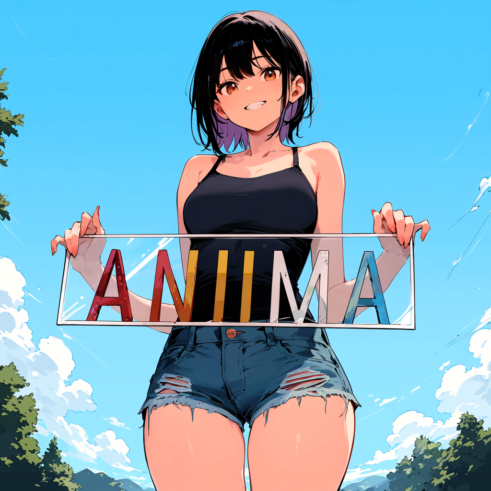
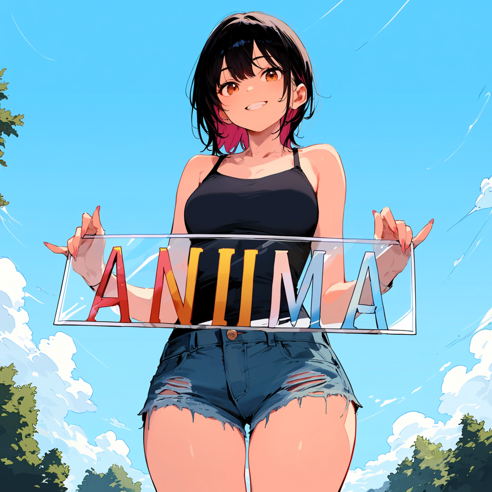
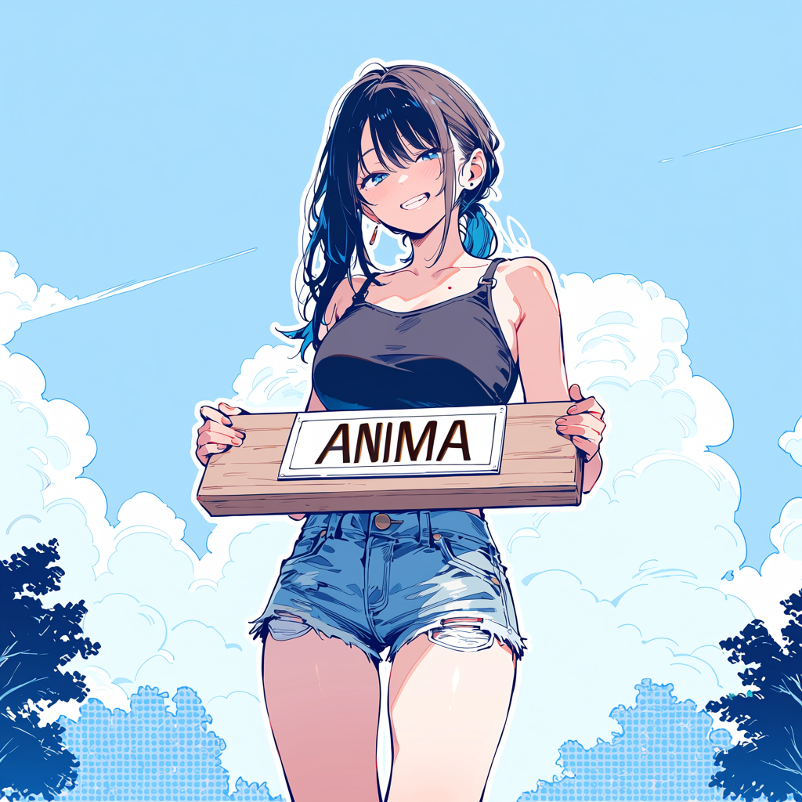
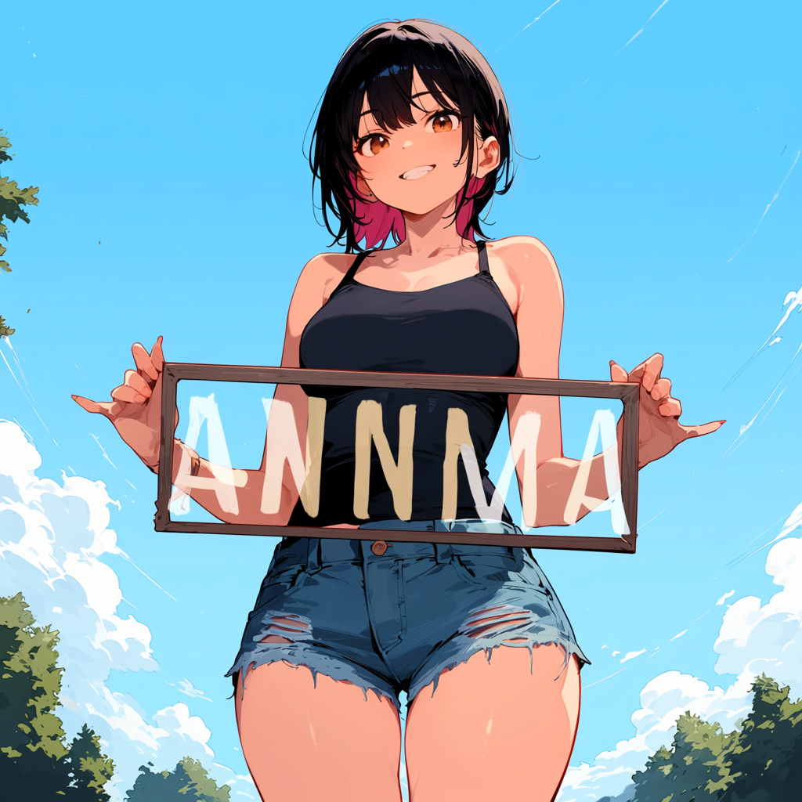
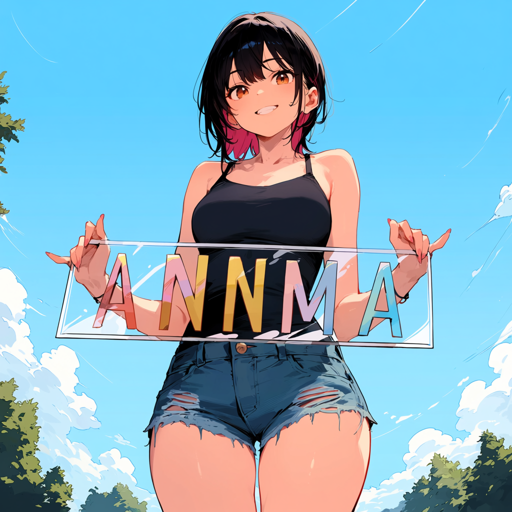
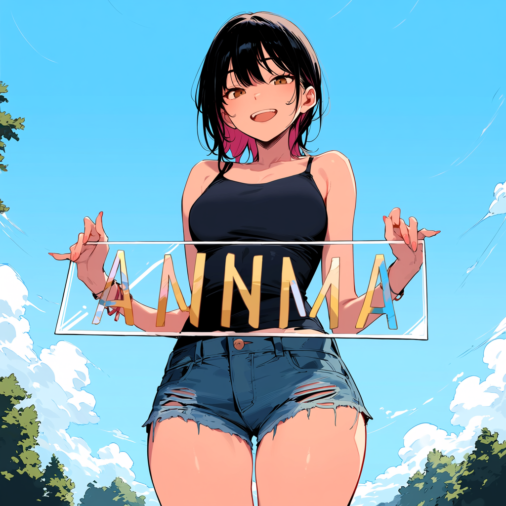
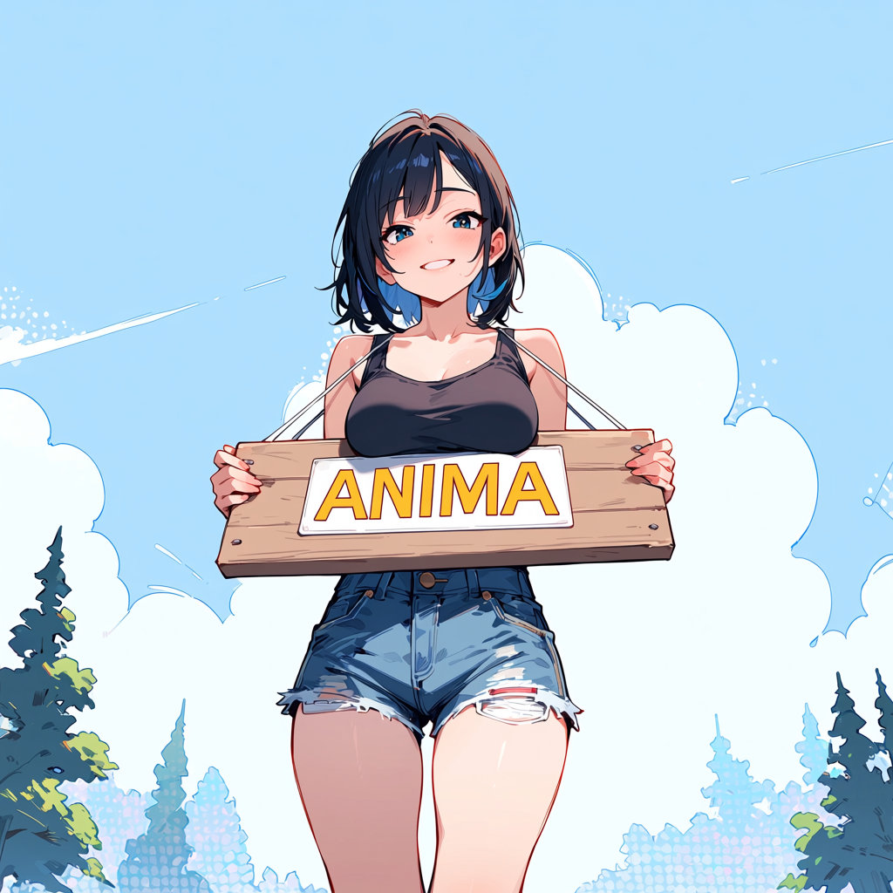

# anima_lora

📖 Guidebook: [English](docs/guidelines/guidebook.md) · [한국어](docs/guidelines/가이드북.md) · [日本語](docs/guidelines/ガイドブック.md) · [中文](docs/guidelines/指南书.md)

<p align="center">
  
</p>

One line — installs [uv](https://astral.sh/uv), selects NVIDIA CUDA or AMD ROCm on Windows, fetches the latest release, runs `uv sync` (Python 3.13 + torch), and opens the GUI (no git required). The installer is published as a signed-by-checksum release asset:

```bash
# Linux / macOS
curl -LsSf https://github.com/sorryhyun/anima_lora/releases/latest/download/install.sh | sh
```
```powershell
# Windows (PowerShell)
irm https://github.com/sorryhyun/anima_lora/releases/latest/download/install.ps1 | iex
```

> **Requirements:** NVIDIA needs at least an Ampere GPU (RTX 3000-series / A100 or newer) and driver **≥595**. The initial Windows ROCm path targets RDNA 4 (`gfx1200` / `gfx1201`) and is certified for Radeon RX 9070 XT. The installer sets up **Python 3.13 + PyTorch 2.12** and either CUDA 13.2 or ROCm 7.14.

Installs into `./anima_lora/` (override with `ANIMA_DIR`). On Windows it also drops an **"Anima LoRA GUI"** shortcut on your desktop.

Windows selects the GPU vendor automatically. Override detection before running the installer with `$env:ANIMA_BACKEND='cuda'` or `$env:ANIMA_BACKEND='rocm'`. ROCm uses PyTorch SDPA for attention and keeps `torch_compile = true`; CUDA keeps the existing Flash Attention path.

<details>
<summary><b>Safer install</b> — inspect &amp; verify the script before running</summary>

Every release ships a `checksums.txt` (SHA-256 of the installers + source archives). Download, verify, then run:

```bash
# Linux / macOS
curl -fLO https://github.com/sorryhyun/anima_lora/releases/latest/download/install.sh
curl -fLO https://github.com/sorryhyun/anima_lora/releases/latest/download/checksums.txt
grep install.sh checksums.txt | sha256sum -c -    # must print "install.sh: OK"
less install.sh                                    # read it
sh install.sh
```
```powershell
# Windows (PowerShell)
iwr https://github.com/sorryhyun/anima_lora/releases/latest/download/install.ps1 -OutFile install.ps1
iwr https://github.com/sorryhyun/anima_lora/releases/latest/download/checksums.txt -OutFile checksums.txt
(Get-FileHash install.ps1 -Algorithm SHA256).Hash.ToLower()   # compare against checksums.txt
notepad install.ps1                                            # read it
powershell -ExecutionPolicy Bypass -File .\install.ps1
```
</details>

**Reproducible / pinned install** — set `ANIMA_VERSION` to install a specific tag instead of latest (the recommended path when you need a known-good environment):

```bash
ANIMA_VERSION=v1.4.0 sh install.sh       # or: $env:ANIMA_VERSION='v1.4.0'; irm ... | iex
```

On Windows the GUI opens automatically when the installer finishes. **Sign in to Hugging Face and download models right in the GUI** — Hugging Face auth is built in now, so there's no `hf auth login` terminal step. Prefer the CLI? After signing in once (the GUI stores your HF token):

```bash
cd anima_lora
make download-models      # DiT + Qwen3 TE + QwenImage VAE (+ SAM3 / MIT / PE for masking & image conditioning) into models/
make gui                  # config editor + dataset browser + training monitor
```

Update later in place with `make update` (release-tarball merge, no git needed). Prefer cloning the repo? See [Setup → Manual](#manual-from-a-clone).

---

LoRA / T-LoRA training and inference engine for the [Anima](https://huggingface.co/circlestone-labs/Anima) diffusion model (DiT-based, flow-matching).

Four things this repo aims to do well:

1. **Fast LoRA training** on consumer GPUs — per-block `torch.compile` over a tiny fixed shape set (one block graph per token-count family), end to end.
2. **Solid conventional implementations** — LoRA (SVD-Down init) and T-LoRA stack together and bake losslessly into a standalone DiT checkpoint.
3. **Inference stacks, engineered for Anima** — Spectrum, SMC-CFG, modulation guidance, SPD, and embedding inversion: training-free, compose with any checkpoint, each implemented end-to-end against Anima's compile contract rather than dropped in as a toy port.
4. **Training stacks beyond the conventional path** — OrthoHydraLoRA, ChimeraHydra, Soft Tokens, Turbo distillation, EasyControl, DirectEdit.

> **At-a-glance diagrams** for every method (DiT internals, LoRA, OrthoLoRA, T-LoRA, HydraLoRA, Spectrum, modulation, compile optimizations) live in [`docs/structure_images/`](docs/structure_images/) — paired with prose walkthroughs in [`docs/structure/`](docs/structure/).

---

## 1. Fast training

**13.4 GB peak VRAM · 1.1 s/step** on a single RTX 5060 Ti while **rank=32 1MP resolution lora training** — achieved by co-designing the data pipeline, attention, and compiler stack so Dynamo sees a tiny fixed set of shapes (one block graph per token-count family) for the whole run.

| Lever | Summary |
|---|---|
| Dynamic graph compilation | `compile_dynamic_seq` marks only the sequence axis dynamic and bounds it to a tier's token-count range. It's auto-enabled whenever `torch_compile` is on (`configs/base.toml` — default **true**, not opt-in): free-fit bucketing (the only resize mode) keeps each image's native aspect ratio and can land its token count anywhere inside a tier's band, which would otherwise blow up into one static graph per distinct shape. Marking the axis dynamic collapses that whole band back to a single compiled graph per token-count family — still addressing the bucket-count blowup the old constant-token-bucket design was built to solve, now without giving up native aspect ratios. |
| Per-block `torch.compile` | Each DiT block compiled independently with Inductor (`compile_blocks()`) — one graph per token-count family, eliminating guard recompilation. |
| QKV / KV fusion | Self- and cross-attention QKV/KV projections are fused into single wide GEMMs instead of three separate Linears — same FLOPs, but the input is read from HBM once, fewer kernel launches, and fewer nodes for Dynamo to trace. `networks/attn_fuse.py` converts fused↔split for ComfyUI-format checkpoints. |
| Activation memory budget | `activation_memory_budget=0.99` caps Inductor's AOT min-cut partitioner's saved-for-backward set, buying back VRAM headroom without gradient checkpointing's compile-graph mismatch risk. We treat gradient checkpointing as a fallback, not a default lever — it's only forced on by the `low_vram` preset. |
| Compile-friendly hot path | Audited every forward for patterns dynamo can't trace cleanly — `einops.rearrange` replaced with explicit `.unflatten()/.permute()` chains, `torch.autocast` context managers replaced with direct `.to(dtype)` casts, dict `.items()` loops hoisted out of compiled regions, FA4 wrapped in `@torch.compiler.disable` for clean graph breaks. |
| Flash Attention 2 | `flash_attn` 2.x with SDPA fallback. FA4 evaluated and removed — see [fa4.md](docs/optimizations/fa4.md). |

Compile pipeline details in [docs/optimizations/for_compile.md](docs/optimizations/for_compile.md).

---

## 2. Solid conventional implementations

The default training config stacks **LoRA (SVD-Down init) + T-LoRA** together. Both fold losslessly into a standalone DiT checkpoint at save time, so you can ship ComfyUI-compatible `*_merged.safetensors` with no adapter loader dependency.

| Variant | Pitch | Details |
|---|---|---|
| **LoRA** | Classic low-rank, rank 16–32. | — |
| **SVD-Down LoRA** | `lora_down` seeded from the pretrained weight's own top-r right singular vectors instead of random Kaiming init (ΔW=0 at start) — same module, save format, and merge path as plain LoRA, just a better starting basis. Default down-init for the LoRA stack. | [svd-down-lora.md](docs/methods/svd-down-lora.md) |
| **T-LoRA** | Timestep-dependent rank masking — low rank at high noise, full rank at low noise. Training-only mask, so merge is bit-equivalent. | [timestep_mask.md](docs/methods/timestep_mask.md) |

**Side-by-side** — same prompt, `er_sde` 30 steps, `cfg=4.0`, 1024². Each LoRA trained at rank 16 for 2 epochs on a 20% subset with training seed 42; inference seeds `{41, 42, 43}`. Reproduce with `python _archive/bench_methods.py`.

|  | **LoRA** | **OrthoLoRA + T-LoRA** |
|:---:|:---:|:---:|
| seed 41 |  |  |
| seed 42 |  |  |
| seed 43 |  |  |

<details>
<summary>Base model and individual variants (plain, OrthoLoRA, T-LoRA)</summary>

|  | **plain (base)** | **OrthoLoRA** | **T-LoRA** |
|:---:|:---:|:---:|:---:|
| seed 41 |  |  |  |
| seed 42 |  |  |  |
| seed 43 |  |  |  |

</details>

**Merging**:

```bash
make merge                                  # bake latest LoRA at multiplier 1.0
make merge ADAPTER_DIR=output/ckpt MULTIPLIER=0.8
```

Refuses non-linear-delta variants (HydraLoRA `_moe`) by default; `--allow-partial` drops those and bakes only the LoRA portion.

---

## Default true path

Beyond the headline methods below, a handful of things ship **on by default** and quietly do a lot of the work — worth knowing even if you never touch a flag.

| Feature | Default | What it does |
|---|---|---|
| Channel scaling | `channel_scaling_alpha = 0.5` | Per-channel LoRA gradient rebalance (SmoothQuant-style) — Adam-specific, inert on frozen-basis ortho variants. [channel_scaling.md](docs/optimizations/channel_scaling.md) |
| SVD-Down LoRA | `down_init = "weight_svd"` | Plain LoRA's `lora_down` is seeded from the pretrained weight's own top-r singular vectors instead of random Kaiming init. [svd-down-lora.md](docs/methods/svd-down-lora.md) |
| Free-fit scaling to target res | always on — the only resize mode | Every image keeps its native aspect ratio and lands its patch-grid token count anywhere inside its resolution tier's band, driving crop loss to ~zero. See [Fast training](#1-fast-training) above. |
| Text area masking | `masked_loss = true` | Excludes tagged regions (e.g. text bubbles) from the training loss. [training.md](docs/guidelines/training.md) |
| AdamW only | `optimizer_type = "AdamW"` | Other optimizers are still wired but unbenched against the current defaults — channel scaling in particular relies on Adam's near-uniform per-element step size. |
| Fixed AdaLN rank | `train_adaln = true`, `adaln_rank = 16` | Trains a low-rank delta on the AdaLN modulation Linears too, not just attention/FFN. **Provisional** — plumbed and default-on but not yet bench-gated; pin it explicitly if you're A/B-ing anything else. [adaln.md](docs/methods/adaln.md) |

---

## 3. Inference stacks

Training-free runtime techniques — no adapter to train, and each composes with any checkpoint (LoRA, merged, or base) purely at generation time.

| Method | What it is | Doc |
|---|---|---|
| **Spectrum inference** | Training-free speedup via Chebyshev polynomial feature forecasting (Han et al., CVPR 2026) — ≈1.75× at default settings, up to ~5× on more aggressive schedules (quality tradeoff). On cached steps every transformer block is skipped — only `t_embedder` + `final_layer` + `unpatchify` run, via a `register_forward_pre_hook` on `final_layer` that captures block outputs without monkey-patching the model; an adaptive window schedule concentrates real forwards on early high-noise steps. Stable ComfyUI node in a separate repo: [ComfyUI-Spectrum-KSampler](https://github.com/sorryhyun/ComfyUI-Spectrum-KSampler). | [spectrum.md](docs/inference/spectrum.md) |
| **SMC-CFG** | Training-free sliding-mode CFG correction in velocity space (Wang et al., CFG-Ctrl) — treats the cond/uncond combine as a control problem on the residual `e = v_cond − v_uncond`, no extra DiT forwards. Ships the **α-adaptive variant**: the paper's fixed gain `k` (≈14× off on Anima at CFG=4, visibly chattering) is replaced with `k_t = α·mean(\|e_t\|)` per step. `make test-smc-cfg` (λ=5, α=0.2); composes with Spectrum and mod-guidance. | [smc_cfg.md](docs/inference/smc_cfg.md) |
| **Modulation guidance** | Steers AdaLN modulation coefficients toward quality-positive directions via a distilled `pooled_text_proj` MLP (Starodubcev et al., ICLR 2026) — training-free *to run*, though the MLP itself is distilled once against the frozen DiT (one-shot loop in `project/finished/mod_guidance/`). Applies at AdaLN time so it composes with any LoRA variant; `make test MOD=1` runs a sample with it enabled (composes with `SPECTRUM=1`). | [mod-guidance.md](docs/inference/mod-guidance.md) |
| **SPD** | Spectral Progressive Diffusion (Xiao et al., 2026) — training-free multi-resolution inference (`--spd`): run early noise-dominated steps at low resolution, then inject high-frequency detail via spectral noise expansion. | [spd.md](docs/inference/spd.md) |
| **Embedding inversion** | Optimize a text embedding to match a target image through the frozen DiT — a test-time optimization, no adapter weights trained. | [invert.md](docs/inference/invert.md) |

---

## 4. Training stacks

Adapter families that train something — a LoRA-style delta, a routing head, or a small conditioning module — on top of the frozen DiT, beyond the conventional LoRA/T-LoRA path in section 2.

| Method | What it is | Doc |
|---|---|---|
| **OrthoHydraLoRA** | MoE-style multi-head LoRA with orthogonalized experts and layer-local routing — shared `lora_down`, per-expert `lora_up_i`, learned per-sample router. Targets multi-style training without the cross-style bleed a single low-rank subspace produces. Original paper: [arXiv:2605.03252](https://arxiv.org/abs/2605.03252). Saves two side-by-side files: `anima_hydra.safetensors` (baked-down LoRA, ComfyUI drop-in) and `anima_hydra_moe.safetensors` (full multi-head); live routing in ComfyUI via the bundled **Anima Adapter Loader** node ([ComfyUI-Anima_lora-Adapter](https://github.com/sorryhyun/ComfyUI-Anima_lora-Adapter)). | [hydra-lora.md](docs/methods/hydra-lora.md) |
| **Turbo** | DP-DMD distillation (Wu et al., arXiv:2602.03139) of the CFG=4 / 28-step teacher into a few-step generator. Output is a **normal LoRA** — composes with concept LoRAs like LCM-LoRA does, fully bakeable into the DiT. Bespoke single-GPU distill loop: `make turbo` (honors `PRESET`, `--queue`); infer at `--infer_steps 4 --cfg 1.0` via `make test-turbo`. A ready-made 4-step student ships at [huggingface.co/sorryhyun/anima-turbo-4step](https://huggingface.co/sorryhyun/anima-turbo-4step). | [turbo.md](docs/methods/turbo.md) |
| **ChimeraHydra** | Dual-pool additive MoE: a content pool (layer-local router) plus a frequency pool (network router on FEI + σ features), each an asymmetric HydraLoRA off a disjoint SVD subspace. Fuses HydraLoRA + TimeStep Master + FeRA. `make exp-chimera`. | [chimera-hydra.md](docs/experimental/chimera-hydra.md) |
| **Soft Tokens** | SoftREPA (Lee et al., NeurIPS 2025) — per-layer × per-t learnable text tokens (~1M params) spliced into `crossattn_emb`; DiT frozen. `make exp-soft-tokens`. | [soft_tokens.md](docs/experimental/soft_tokens.md) |
| **DirectEdit + Anima Tagger** | Flow-inversion image editing (Yang & Ye, 2026) — invert to noise, swap edit conditioning, re-denoise with V-injection. Source captions come from the **Anima Tagger**, a trained image → Anima-format tag model, for ψ_src. `make exp-test-directedit`. | [directedit_editing_v3.md](docs/experimental/directedit_editing_v3.md) |
| **EasyControl** | Extended self-attention image conditioning. DiT frozen; trains per-block cond LoRA on self-attn + FFN + scalar `b_cond` gate. | [easycontrol.md](docs/experimental/easycontrol.md) |

> **Want to contribute?** An area where outside help would have outsized impact: **EasyControl adapters** (canny / depth / pose / … — each control type is one self-contained PR). See [CONTRIBUTING.md → Priority areas](CONTRIBUTING.md#priority-areas).

---

## Setup

> Quick one-line install is up top in [How to start](#how-to-start). The manual clone path is below.

### Manual (from a clone)

```bash
# Linux / macOS / Windows NVIDIA (CUDA is the default backend)
uv sync

# Windows AMD (ROCm) only:
uv sync --no-group cuda-windows --group rocm-windows

hf auth login             # or just sign in from the GUI — auth is built in now
make download-models      # DiT + Qwen3 TE + QwenImage VAE (+ SAM3 / MIT / PE for masking & image conditioning) into models/
# place training images in image_dataset/ with .txt caption sidecars
make gui                  # recommended — config editor + dataset browser + training monitor
```

On Windows, `cuda-windows` is a **default dependency group** — a plain `uv sync` always lands the CUDA stack, so NVIDIA users can never be demoted to a CPU/ROCm torch by a flagless sync (GH #92). The two backend groups are declared mutually exclusive so `uv` cannot mix CUDA and ROCm wheels; ROCm users must reuse the same `--no-group cuda-windows --group rocm-windows` flags for later manual syncs. `make update` remembers the backend selected by the installer. The CUDA manual-clone path does **not** auto-install the CUDA 13.2 **toolkit** (needed for `torch.compile`/Triton) — install it per [guidebook §2](docs/guidelines/guidebook.md#2-cuda-132-handled-by-the-installer), or use the one-line installer above. The ROCm extra uses AMD's official ROCm 7.14 package index and does not install Flash Attention; `triton-windows` remains present because it supplies the Windows runtime used by `torch.compile` on both backends.

> **Anima ships as a uv-locked application environment, not a generic pip package.** `pyproject.toml` pins `python ==3.13.*`, specific torch / flash-attn wheel URLs, and `index-strategy = "unsafe-best-match"` — these are maintainer-chosen, known-good builds. Install with `uv sync` against the committed `uv.lock`; don't `pip install` from `pyproject.toml` (pip won't honor uv's index strategy or the prebuilt flash-attn wheels).

CLI path:

```bash
make preprocess           # VAE-compatible resize & validation
make lora                 # or: PRESET=fast_16gb make lora / PRESET=low_vram make lora / make exp-chimera
make test                 # sample generation with the latest trained LoRA
```

Config chain: `configs/base.toml → configs/presets.toml[<preset>] → configs/methods/<method>.toml → CLI args`. Override with `PRESET=low_vram make lora` or `--network_dim 32 --max_train_epochs 64`. Full flag reference in [docs/guidelines/training.md](docs/guidelines/training.md) and [docs/guidelines/inference.md](docs/guidelines/inference.md).

---

## Documentation

| Doc | Contents |
|-----|----------|
| [guidelines/training.md](docs/guidelines/training.md) | Training flags, LoRA variants, caption shuffle, masked loss, dataset config |
| [guidelines/inference.md](docs/guidelines/inference.md) | Inference flags, P-GRAFT, prompt files, LoRA format conversion |
| [optimizations/](docs/optimizations/) | Compile pipeline, FA4 post-mortem, CUDA 13.2 |
| [methods/](docs/methods/) | One doc per method — HydraLoRA, Spectrum, inversion, mod guidance, T-LoRA, SVD-Down LoRA |

---

## License

Toolkit code: [MIT](LICENSE).

Portions of this toolkit are **derived from [kohya-ss/sd-scripts](https://github.com/kohya-ss/sd-scripts)**, which is licensed under the **Apache License, Version 2.0**. Those portions remain governed by Apache 2.0 — the full license text is in [LICENSE-APACHE](LICENSE-APACHE), and attribution plus a statement of modifications is in [NOTICE](NOTICE). Thanks to kohya-ss and the sd-scripts contributors for their foundational work.

Anima / CircleStone **base model weights** ship under the **CircleStone Labs Non-Commercial License v1.0** and are not relicensed by this repo. Any LoRA, fine-tune, or merged checkpoint trained from those weights is a Derivative and inherits the non-commercial terms. See [NOTICE](NOTICE).
