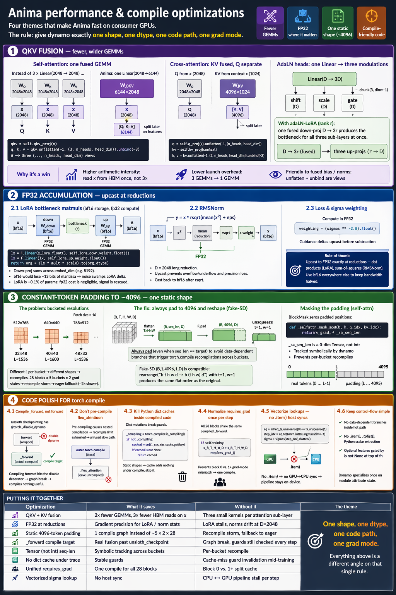

# Anima performance & compile optimizations

A tour of the non-obvious decisions the codebase makes to run fast on consumer GPUs. Four themes, each ending with the *why* — most of these look strange until you see what breaks when they're absent.

1. **QKV fusion** — fewer, wider GEMMs.
2. **FP32 accumulation in the right places** — bf16 for storage, fp32 for the reductions that bf16 would wreck.
3. **Constant-token padding to `~4096`** — one static shape so `torch.compile` stops recompiling.
4. **Compile-friendly code polish** — the dozen little rules that keep dynamo's guard cache from evicting.



---

## 1. QKV fusion

### Self-attention: one fused GEMM

`library/anima/models.py:358` — for a self-attention module with $d_\text{in} = d_\text{out} = 2048$, three `Linear(2048 → 2048)` projections would issue three separate GEMMs:

$$
Q = W_Q x,\quad K = W_K x,\quad V = W_V x
$$

Anima instead stacks the three projections into one weight $W_{QKV} \in \mathbb{R}^{6144 \times 2048}$ and fires a single matmul:

$$
\begin{bmatrix} Q \\ K \\ V \end{bmatrix} \;=\; W_{QKV}\,x, \qquad
W_{QKV} = \begin{bmatrix} W_Q \\ W_K \\ W_V \end{bmatrix}
$$

Split happens post-matmul on the feature axis (`library/anima/models.py:409`):

```python
qkv = self.qkv_proj(x)                                                  # (..., 6144)
q, k, v = qkv.unflatten(-1, (3, self.n_heads, self.head_dim)).unbind(-3)  # three (..., 16, 128)
```

Why this is a win:

- **Arithmetic intensity.** One `[6144 × 2048]` GEMM has roughly the same FLOPs as three `[2048 × 2048]` GEMMs but fetches the input `x` from HBM only once instead of three times. On bf16 with large batch-seq, those reads dominate.
- **Kernel launch overhead.** Three GEMM launches vs. one — matters at short sequences and during compile tracing (fewer nodes in the graph).
- **Fused bias / norm friendliness.** `unflatten + unbind` is a pure view, so the subsequent `q_norm / k_norm / RoPE` operate on views of the same contiguous buffer.

### Cross-attention: KV fused, Q separate

Cross-attention reads $x \in \mathbb{R}^{2048}$ for Q and a *different* context $c \in \mathbb{R}^{1024}$ for K, V. You can't fuse Q with KV — different input dims, different matmuls. Anima fuses only what's fusable (`library/anima/models.py:360–361`):

$$
Q = W_Q\,x \in \mathbb{R}^{2048}, \qquad
\begin{bmatrix} K \\ V \end{bmatrix} = W_{KV}\,c \in \mathbb{R}^{4096}
$$

Split is symmetric (`models.py:413`):

```python
q  = self.q_proj(x).unflatten(-1, (n_heads, head_dim))
kv = self.kv_proj(context)
k, v = kv.unflatten(-1, (2, n_heads, head_dim)).unbind(-3)
```

### AdaLN heads: one Linear → three modulations

The same trick on the modulation side. Each sub-layer needs `(shift, scale, gate)`, a triple of `D`-vectors. Instead of three `Linear(D → D)` you see one `Linear(D → 3D)` split via `.chunk(3, dim=-1)` (`library/anima/models.py:1014–1022`, split at `1090–1098`):

$$
[b_\star,\,s_\star,\,g_\star]\ =\ W^{\text{adaLN}}_\star\,\text{SiLU}(t_\text{emb})
\quad\in\mathbb{R}^{3D}
$$

With `adaLN-LoRA` enabled (`models.py:1006–1012`), the saving compounds: one fused down-proj `Linear(D → 3·r_\text{adaLN})` produces the bottleneck for all three sub-layers at once, and only the three up-projs remain per-sub-layer.

---

## 2. FP32 accumulation

Bf16 has 8 mantissa bits. That's fine for *storing* weights and activations, but it's catastrophic for long reductions — summing thousands of bf16 products accumulates rounding error proportional to $\sqrt{N} \cdot 2^{-8}$. Anima promotes to fp32 in the exact three places where this bites.

### 2.1 LoRA bottleneck matmuls

`networks/lora_modules/lora.py:62–94`. The module stores weights in bf16 but runs both matmuls in fp32:

```python
lx = F.linear(x_lora.float(), self.lora_down.weight.float())   # fp32
...
lx = F.linear(lx, self.lora_up.weight.float())                 # fp32
return org_forwarded + (lx * self.multiplier * scale).to(org_forwarded.dtype)
```

Quoting the in-source rationale:

> bf16 storage, fp32 for the bottleneck matmuls. The down-proj accumulates over `embed_dim` (large) and the up-proj output is added back to the bf16 base; running both matmuls in fp32 recovers mantissa precision that bf16 would shed.

The down-proj sums across up to $d_\text{in} = 8192$ (e.g. `mlp.layer2`). That's ~13 mantissa bits of noise floor — the LoRA delta is small by construction, so noise of that magnitude would swamp the signal. Fp32 accumulation adds an ignorable amount of compute (LoRA is ~0.1% of params) and rescues the gradient signal.

### 2.2 RMSNorm

`library/anima/models.py:291–296` — every norm upcasts before computing:

```python
def _norm(self, x):
    return x * torch.rsqrt(x.pow(2).mean(-1, keepdim=True) + self.eps)

def forward(self, x):
    output = self._norm(x.float())              # ← fp32 variance
    return (output * self.weight).to(x.dtype)   # ← cast back
```

$\text{mean}(x^2)$ at `D = 2048` is another long reduction — bf16 can over/underflow the squared intermediate when any channel is large. The cast back happens after `rsqrt`, so the rest of the block sees bf16.

### 2.3 Loss & sigma weighting

In `train.py` / `library/anima/training.py`, $\sigma$ weighting is computed in fp32 (`weighting = (sigmas**-2.0).float()`, `library/runtime/noise.py:86`) and guidance deltas for CFG are upcast before subtraction. Both are low-volume pointwise ops where fp32 is free.

### The rule

Upcast to fp32 **exactly at reductions** — the dot products inside LoRA, the sum-of-squares inside RMSNorm. Leave bf16 everywhere else so HBM bandwidth stays halved.

---

## 3. Constant-token padding to `~4096`

### The problem

Bucketed training allows images of different aspect ratios: `512×768`, `768×512`, `640×640`, etc. After `PatchEmbed` with patch size 16, each bucket produces a different sequence length:

$$
L_\text{bucket} = \frac{H}{16}\cdot\frac{W}{16}
$$

A naive implementation lets this shape propagate through the DiT. Every bucket then triggers `torch.compile` to retrace and recompile — and with 28 blocks × 5 buckets × 2 `requires_grad` states, you blow past dynamo's recompile limit and fall back to eager. Losing the compiled path is a ~2× regression.

### The fix

`library/anima/models.py:1593–1621`. Pad the token axis of every batch to a single fixed target (default `4096`, `configs/base.toml:32`) and reshape into a *fake-5D* tensor that the block code already knows how to consume:

```python
target = self.static_token_count                      # e.g. 4096
B, T, H, W, D = x.shape
seq_len = T * H * W

x = x.flatten(1, 3)                                   # (B, seq_len, D)
x = F.pad(x, (0, 0, 0, target - seq_len))             # (B, target, D) — always
x = x.unsqueeze(1).unsqueeze(3)                       # (B, 1, target, 1, D)
```

Two comments in the source drive the subtle points:

> Always pad (even when `seq_len == target`) to avoid a data-dependent branch that causes `torch.compile` recompilation across bucket shapes.

> The fake-5D shape `(B, 1, target, 1, D)` is compatible with existing Block code because `rearrange("b t h w d -> b (t h w) d")` with `t=1, w=1` produces the same flat sequential order as the original.

So the shape is always `(B, 1, 4096, 1, D)` regardless of bucket. `RoPE` cos/sin get padded identically (lines 1617–1621), keeping every tensor consumed by every block the same shape.

### Masking the padding

Padded tokens must not leak into softmax. In `flex` attention mode a `BlockMask` zeroes them out (`models.py:1725–1726`):

```python
def _selfattn_mask_mod(b, h, q_idx, kv_idx):
    return kv_idx < _sa_seq_len
```

And `_sa_seq_len` is deliberately a **0-dim tensor, not a Python int** (`models.py:1719–1721`):

> Use a tensor instead of a Python `int` so dynamo tracks it symbolically rather than guarding on the exact value. A plain int in the `mask_mod` closure causes a recompile per bucket size.

A detail that only matters once you've watched it happen: switching from `int` to `Tensor` is the difference between one compile and five.

### Cross-attention side: bucketed KV

Cross-attention KV length (the text sequence) is similarly bucketed — to one of `(128, 192, 256, 512)` — so there are at most 4 compile variants for the cross-attn path (`library/anima/models.py:19–20`):

```python
_KV_BUCKETS = (128, 192, 256, 512)  # Keeps torch.compile shapes stable.
```

Because padding tokens were trimmed from the KV side (padding is kept in training, but the *bucketed* K/V drops positions beyond the smallest covering bucket), the softmax denominator loses some zero-key sinks. An **LSE correction** in `networks/attention.py` adds back a sigmoid-based term using `crossattn_full_len` so the softmax normalization is consistent with the unbucketed case.

---

## 4. Code polish for `torch.compile`

`configs/base.toml:32` sets `torch_compile = true` by default. `library/anima/models.py:1385–1400` compiles each block's `_forward` individually:

```python
def compile_blocks(self, backend="inductor"):
    for i, block in enumerate(self.blocks):
        block._forward = torch.compile(block._forward, backend=backend, dynamic=False)
```

Note `dynamic=False` — static shapes (from §3) mean dynamic tracing would only buy recompile risk. The comment in source explains why `_forward` not `forward`:

> Compiles `_forward` (the actual attention/MLP computation) rather than `forward` (the checkpointing wrapper). This is critical because `unsloth_checkpoint` has `@torch._disable_dynamo`, which causes an immediate graph break if `forward` itself is compiled.

That's a load-bearing two-line change. If `forward` is the compile target, dynamo hits the disable decorator, emits a graph break, and compiles essentially nothing while still paying the full guard-check cost per step.

Five more rules the code follows:

### 4.1 Don't pre-compile flex_attention

`networks/attention.py:40–46`:

```python
# Do NOT pre-compile flex_attention here. When blocks are individually
# compiled (static_token_count mode) or the full model is compiled,
# the outer torch.compile already traces into _flex_attention and fuses it.
# Pre-compiling causes nested compilation which exhausts dynamo's
# recompile limit (grad_mode guard × mask variants) and falls back to
# the slow unfused path.
compiled_flex_attention = _flex_attention
```

Nested compilation is a pit trap — dynamo tries to compile from the outside and hits an already-compiled callable inside, guards disagree, it gives up.

### 4.2 Kill Python dict caches inside compiled code

`library/anima/models.py:566–570` — the RoPE cache is *skipped* when tracing:

```python
_compiling = torch.compiler.is_compiling()
if not _compiling:
    cached = self._cos_sin_cache.get(key)
    if cached is not None:
        return cached
```

Why: dict mutations are dynamo guard failures. Since static shapes mean RoPE always produces the same output anyway, the cache adds nothing under compile and costs a guard invalidation.

### 4.3 Normalize `requires_grad` once per step

`library/anima/models.py:1737–1742`:

```python
# All blocks share the same compiled _forward, so a mismatch triggers
# dynamo recompilation.
if self.training:
    x_B_T_H_W_D = x_B_T_H_W_D.requires_grad_()
```

Block 0 sees a frozen patch-embed output (`requires_grad=False`); blocks 1+ see a LoRA-activated tensor. If the compiled `_forward` is reused across all 28 blocks, the grad-mode guard differs on block 0 and triggers a second compile. A single `requires_grad_()` up front unifies the guard.

### 4.4 Vectorize lookups — no `.item()` host syncs

`library/runtime/noise.py:46–56` shows the pattern:

```python
# a single broadcast-equality + argmax finds the right index per batch
# element without per-element .item() host syncs.
eq = schedule_timesteps.unsqueeze(0) == timesteps.unsqueeze(1)   # [B, N]
step_indices = eq.to(torch.int8).argmax(dim=-1)                  # [B]
sigma = sigmas[step_indices].flatten()
```

A `.item()` call forces a GPU→CPU sync and stalls the pipeline. Vectorizing into broadcast ops keeps everything on-device and lets dynamo trace a single graph.

### 4.5 Keep in-place / control-flow simple

Reading `_forward` (`models.py:1067+`) and `forward_mini_train_dit` (`1537+`), the patterns are:

- no `if x.shape[0] > 1: …` data-dependent branches inside the hot path;
- no Python-side scalar extraction (`.item()`, `.tolist()`);
- optional features (ReFT, mod-guidance, postfix) are gated by `is not None` checks at the top of the function, where dynamo can specialize the trace once based on the module's attribute state.

---

## Putting it together

| Optimization              | What it saves                              | Without it                                    |
| ------------------------- | ------------------------------------------ | --------------------------------------------- |
| QKV + KV fusion           | 2× fewer GEMMs, 3× fewer HBM reads on x    | Three small kernels per attention sub-layer   |
| Fp32 at reductions        | Gradient precision for LoRA / norm stats   | LoRA stalls, norms drift at D=2048            |
| Static 4096-token padding | 1 compile graph instead of `~5 × 2 × 28`   | Recompile storm, fallback to eager            |
| `_forward` compile target | Real fusion past `unsloth_checkpoint`      | Graph break, guards still checked every step  |
| Tensor (not int) seq-len  | Symbolic tracking across buckets           | Per-bucket recompile                          |
| No dict cache under trace | Stable guards                              | Cache-miss guard invalidation mid-training    |
| Unified `requires_grad`   | One compile for all 28 blocks              | Block 0 vs. 1+ split cache                    |
| Vectorized sigma lookup   | No host sync                               | CPU ↔ GPU pipeline stall per step             |

The theme: **give dynamo exactly one shape, one dtype, one code path, one grad mode.** Everything above is a different angle on that single rule.
