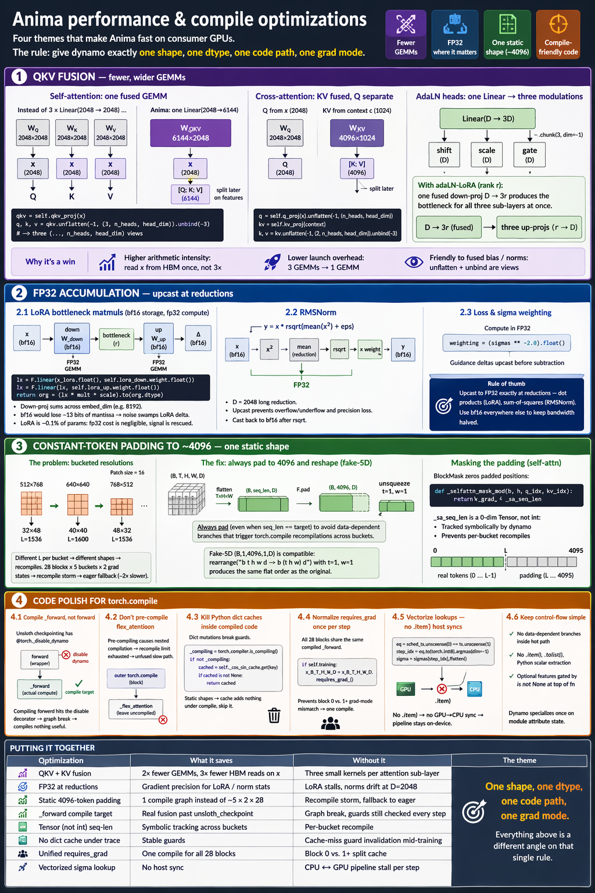

# Anima performance & compile optimizations

Why training runs fast on consumer GPUs. Four themes, each one answer to the same question: what does `torch.compile` (or the memory bus) punish, and how does the code avoid it?

1. QKV fusion — fewer, wider GEMMs.
2. Precision policy — bf16 for storage and bandwidth, fp32 exactly where reductions would drown the signal.
3. Free-fit bucketing + one graph per tier — native-shape training without a recompile storm.
4. Compile-friendly code polish — the handful of rules that keep dynamo's guard cache stable.



---

## 1. QKV fusion

### Self-attention: one fused GEMM

For a self-attention module with $d_\text{in} = d_\text{out} = 2048$, three `Linear(2048 → 2048)` projections would issue three separate GEMMs:

$$
Q = W_Q x,\quad K = W_K x,\quad V = W_V x
$$

Anima instead stacks the three projections into one weight $W_{QKV} \in \mathbb{R}^{6144 \times 2048}$ and fires a single matmul, splitting post-hoc on the feature axis:

```python
qkv = self.qkv_proj(x)                                                     # (..., 6144)
q, k, v = qkv.unflatten(-1, (3, self.n_heads, self.head_dim)).unbind(-3)   # three (..., 16, 128)
```

Why this is a win:

- Arithmetic intensity. One `[6144 × 2048]` GEMM has roughly the same FLOPs as three `[2048 × 2048]` GEMMs but fetches the input `x` from HBM only once instead of three times. On bf16 with large batch-seq, those reads dominate.
- Kernel launch overhead. One launch instead of three — matters at short sequences and during compile tracing (fewer nodes in the graph).
- Fused bias / norm friendliness. `unflatten + unbind` is a pure view, so the subsequent `q_norm / k_norm / RoPE` operate on views of the same contiguous buffer.

### Cross-attention: KV fused, Q separate

Cross-attention reads $x \in \mathbb{R}^{2048}$ for Q and a different context $c \in \mathbb{R}^{1024}$ for K, V. Q can't join the fusion — different input tensor — so Anima fuses only what's fusable:

$$
Q = W_Q\,x \in \mathbb{R}^{2048}, \qquad
\begin{bmatrix} K \\ V \end{bmatrix} = W_{KV}\,c \in \mathbb{R}^{4096}
$$

### AdaLN heads: one Linear → three modulations

The same trick on the modulation side. Each sub-layer needs `(shift, scale, gate)`, a triple of `D`-vectors. Instead of three `Linear(D → D)` there is one `Linear(D → 3D)` split via `.chunk(3, dim=-1)`.

One consequence worth knowing for adapter work: the fused projections mean the on-disk LoRA layout (split `q/k/v_proj` keys, for ComfyUI compatibility) differs from the runtime layout. `networks/attn_fuse.py` is the single source of truth for that fuse↔split mapping — save always writes split, load always re-fuses.

---

## 2. Precision policy: bf16 everywhere, fp32 where reductions bite

Bf16 has 8 mantissa bits. That's fine for storing weights and activations, but long reductions accumulate rounding error proportional to $\sqrt{N} \cdot 2^{-8}$. The rule the codebase follows: stay bf16 for bandwidth, upcast at the specific reductions where bf16 would destroy the statistic being computed.

### 2.1 RMSNorm

Every norm upcasts before computing:

```python
def _norm(self, x):
    return x * torch.rsqrt(x.pow(2).mean(-1, keepdim=True) + self.eps)

def forward(self, x):
    output = self._norm(x.float())              # ← fp32 variance
    return (output * self.weight).to(x.dtype)   # ← cast back
```

$\text{mean}(x^2)$ at `D = 2048` is a long reduction — bf16 can over/underflow the squared intermediate when any channel is large. The cast back happens after `rsqrt`, so the rest of the block sees bf16.

### 2.2 Loss & sigma weighting

σ-weighting is computed in fp32 (`library/runtime/noise.py`) and guidance deltas for CFG are upcast before subtraction. Both are low-volume pointwise ops where fp32 is free.

### 2.3 What is deliberately NOT fp32: the LoRA bottleneck

The LoRA rank GEMMs used to run in fp32 as a third upcast site. That path was removed 2026-06-10 after a bench showed the outputs bit-identical: training forwards now run the rank GEMMs in the model compute dtype — specifically `org_forwarded.dtype`, *not* `x.dtype` (`networks/lora_modules/base.py`; guarded by `tests/test_lora_dtype_policy.py`).

The distinction is load-bearing: under `autocast(bf16)`, AdaLN's LayerNorm hands the LoRA module an fp32 input while the frozen Linear's output is bf16 — keying the delta's dtype off the input would produce a dtype mismatch on the residual add. Inference/merge paths still compute deltas in fp32, where the one-time cost is irrelevant.

So the current rule has two halves: upcast at reductions that compute statistics (norms, losses); trust autocast's dtype for the adapter GEMMs, keyed off the frozen output's dtype.

---

## 3. Free-fit bucketing + one compiled graph per tier

### The problem

Aspect-ratio bucketing means images of many shapes. After `PatchEmbed` (patch 16), each shape produces a different sequence length $L = (H/16)(W/16)$. If that shape propagates naively through the DiT, every distinct $L$ triggers `torch.compile` to retrace — with 28 blocks and dozens of shapes you blow past dynamo's recompile limit and fall back to eager, a ~2× regression.

### Two dead ends before the current answer

The history explains the design, so it's worth one paragraph:

- Pad everything to one static shape (removed 2026-05-24). Under `attn_mode="flash"` there is no padding mask, and zero-padded tokens are not harmless — AdaLN shift and QKV bias leak them into real-token outputs (measured up to ~6.5% rel-L2). Padding also caps the biggest usable resolution tier.
- A discrete constant-token bucket pool (the 4032/4200 families; removed 2026-06-19). Zero padding by construction and only two graphs — but every image had to be cropped/warped onto a small set of exact token counts, paying real crop loss.

### The current mode: free-fit — and it's the only mode

Free-fit (`library/datasets/buckets.py`) keeps each image's native aspect ratio and lets its patch-grid token count land anywhere inside its resolution tier's band. There is no flag; it's how preprocessing and training work, full stop. Crop loss drops to the sub-patch residual (<16 px).

`EDGE_TOKEN_BANDS` defines the per-tier bands:

| Tier edge | Token band |
|---|---|
| 512 | 1008–1024 |
| 768 | 2160 |
| 896 | 3000–3024 |
| 1024 | 4032–4200 *(frozen)* |
| 1280 | 6300 |
| 1536 | 8640 |

Each image goes to the tier that resizes it the least — `choose_edge` minimizes the area distortion $|\log(\text{nominal tokens}/\text{native tokens})|$, which is scale-symmetric, so a 0.95 MP image stays at the 1024 tier rather than being shrunk to 768. The 1024 band stays frozen at (4032, 4200) because the frozen aspect set `DCW_ASPECT_BUCKETS` (still consumed by CNS calibration and mod-distill) is drawn from it.

Caches are the source of truth: `make_buckets()` uses the actual on-disk cached `(W,H)` as the bucket set, so nothing snaps at load time, and training needs no `--target_res` — the tiers present are whatever the caches actually populate.

### The compile coupling: dynamic seq, bounded per tier

Free-fit populates *many* distinct token counts inside a band — statically compiling each one would be the recompile storm all over again. The answer is `compile_dynamic_seq`: mark only the sequence axis dynamic and bound it to the tier's band, collapsing the whole band to one graph per tier. `train.py` auto-enables it whenever `torch_compile` is on, and derives the dynamo budget (`compile_blocks(n_token_families=…)`) from the buckets the filtered dataset actually populates (`_derive_token_budget`), plus sample-prompt resolutions when sampling is enabled.

The mechanism that makes "one guard per tier" possible is the fake-5D flatten (`_native_flatten`): under compile, the block input `(B, T, H, W, D)` is flattened to `(B, 1, seq_len, 1, D)`:

```python
x = x.flatten(1, 3)              # (B, seq_len, D)
x = x.unsqueeze(1).unsqueeze(3)  # (B, 1, seq_len, 1, D)
```

This makes the block graph key on token count alone rather than guarding `H` and `W` separately (which would recompile per resolution). It's bit-exact to the eager 5D path because `rearrange("b t h w d -> b (t h w) d")` with `t=1, w=1` produces the same flat order. Eager forwards skip the reshape entirely.

### Cross-attention side: full-length KV, always

The text sequence is fixed: zero-padded to 512 tokens, and the padding tail is a load-bearing attention sink the pretrained model expects (`anima.md` §2.4). So the cross-attn path is shape-stable for free. (A flash4-era KV-trim + LSE-correction path existed here; it was removed with FA4 on 2026-05-20 — see `docs/optimizations/fa4.md`.)

---

## 4. Code polish for `torch.compile`

`torch_compile = true` is the default (`configs/base.toml`), and per project convention block-compile is the first lever to reach for on OOM — before gradient checkpointing.

### 4.0 Compile `_forward`, not `forward`

`compile_blocks()` compiles each block's `_forward` (the actual attention/MLP computation), not `forward` (the checkpointing wrapper):

> This is critical because `unsloth_checkpoint` has `@torch._disable_dynamo`, which causes an immediate graph break if `forward` itself is compiled.

If `forward` were the compile target, dynamo would hit the disable decorator, emit a graph break, and compile essentially nothing while still paying the guard-check cost per step. This also has a hook consequence: `register_forward_hook` on a block survives compilation (the hook machinery runs eagerly around the compiled inner), but hooks on submodules invoked inside `_forward` get traced over — REPA and probe tooling rely on the former.

With free-fit, `compile_blocks` runs with the seq axis marked dynamic per tier (§3); on the fully-static path it keeps `dynamic=False`, since dynamic tracing would only buy recompile risk.

### 4.1 Don't pre-compile flex_attention

`networks/attention_dispatch.py`:

```python
# Do NOT pre-compile flex_attention here. When blocks are individually
# compiled, the outer torch.compile already traces into _flex_attention
# and fuses it. Pre-compiling causes nested compilation which exhausts
# dynamo's recompile limit and falls back to the slow unfused path.
compiled_flex_attention = _flex_attention
```

Nested compilation is a pit trap — dynamo compiles from the outside, hits an already-compiled callable inside, guards disagree, it gives up.

### 4.2 Kill Python dict caches inside compiled code

The RoPE cache is skipped when tracing (`library/anima/models.py`):

```python
if not torch.compiler.is_compiling():
    cached = self._cos_sin_cache.get(key)
    if cached is not None:
        return cached
```

Dict mutations are dynamo guard failures. Under compile the RoPE result is fused into the graph anyway, so the cache adds nothing and costs a guard invalidation.

### 4.3 Normalize `requires_grad` once per step

Block 0 sees a frozen patch-embed output (`requires_grad=False`); blocks 1+ see a LoRA-activated tensor. All blocks share the same compiled `_forward`, so that mismatch would trigger a second compile. A single `requires_grad_()` on the block-stack input up front unifies the guard.

### 4.4 Vectorize lookups — no `.item()` host syncs

The per-batch sigma lookup (`library/runtime/noise.py`):

```python
# a single broadcast-equality + argmax finds the right index per batch
# element without per-element .item() host syncs.
eq = schedule_timesteps.unsqueeze(0) == timesteps.unsqueeze(1)   # [B, N]
step_indices = eq.to(torch.int8).argmax(dim=-1)                  # [B]
sigma = sigmas[step_indices].flatten()
```

A `.item()` call forces a GPU→CPU sync and stalls the pipeline. The same rule shows up in T-LoRA's mask build (`timestep-mask.md`), which stays on-device end to end.

### 4.5 Keep control flow trace-stable

In the block hot path:

- no data-dependent Python branches (`if x.shape[0] > 1: …`);
- no Python-side scalar extraction (`.item()`, `.tolist()`);
- optional features (mod-guidance, xattn gain, registers) gated by `is not None` / buffer-presence checks at the top of the function, where dynamo specializes the trace once on the module's attribute state.

---

## Putting it together

| Optimization                     | What it saves                                        | Without it                                   |
| -------------------------------- | ---------------------------------------------------- | -------------------------------------------- |
| QKV + KV fusion                  | 2–3× fewer GEMMs and HBM reads per attention layer   | Three small kernels per sub-layer            |
| fp32 at statistic reductions     | Norm/loss precision at D=2048                        | Norms drift, σ-weights lose mantissa         |
| Compute-dtype LoRA GEMMs         | Bandwidth (bit-identical to the removed fp32 path)   | 2× LoRA activation traffic for nothing       |
| Free-fit + dynamic-seq compile   | One graph per resolution tier, ~zero crop loss       | Recompile storm or pad leakage into attention|
| `_forward` compile target        | Real fusion past `unsloth_checkpoint`                | Graph break, guards still checked every step |
| No dict cache under trace        | Stable guards                                        | Cache-miss guard invalidation mid-training   |
| Unified `requires_grad`          | One compile for all 28 blocks                        | Block 0 vs. 1+ split cache                   |
| Vectorized sigma lookup          | No host sync                                         | CPU ↔ GPU pipeline stall per step            |

The theme: **give dynamo one code path and one guard set per tier, and give the memory bus bf16 everywhere a statistic isn't being computed.**
