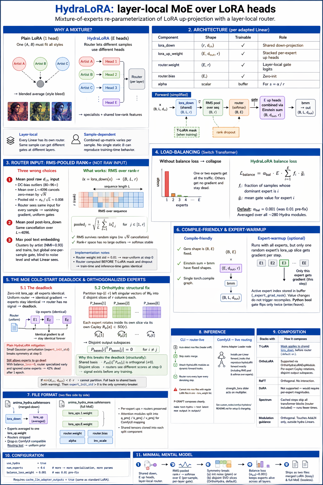

# HydraLoRA: layer-local MoE over LoRA heads

A mixture-of-experts re-parameterization of the LoRA up-projection. Each adapted `Linear` gets a **shared** `lora_down`, **$E$ parallel `lora_up` heads**, and a **layer-local** router that reads the rank-$r$ bottleneck activation and emits a per-sample softmax over those $E$ heads. The effective up-matrix becomes sample-dependent, so distinct clusters of training samples (e.g. different artists, different styles) can push different heads in different directions without collapsing into a single shared subspace.

Recap from `lora.md`: every target `Linear` $W_0$ is adapted by $y = W_0 x + m \cdot s \cdot B A x$, with $A \in \mathbb{R}^{r \times d_\text{in}}$ (down, shared) and $B \in \mathbb{R}^{d_\text{out} \times r}$ (up). HydraLoRA keeps $A$ exactly as before and replaces the single $B$ with $E$ stacked copies plus a routing module that mixes them per sample.



---

## 1. Why a mixture

A plain LoRA trained on multiple distinct styles (e.g. three artists) has to fit all of them through **one** shared $(A, B)$ pair. The optimizer's best rank-$r$ compromise is a subspace that captures the *common* structure — i.e. the union looks like a blended average of the three artists rather than any of them specifically. You see this as "style bleed": the generated images pick up a muddled in-between look, and distinct artist fingerprints disappear.

The MoE fix is structural: keep the low-rank bottleneck but give the up-projection $E$ heads, and let a router pick a per-sample mixture. If sample $x_i$ comes from artist A and sample $x_j$ from artist B, the router can push their gates toward different experts, and those experts then receive differentiated gradient updates. The common features stay in the shared `lora_down`; the head-specific steering lives in the per-expert `lora_up`.

---

## 2. Architecture

Per adapted Linear, `HydraLoRAModule` stores:

| Component         | Shape                                      | Trainable | Role                                         |
| ----------------- | ------------------------------------------ | --------- | -------------------------------------------- |
| `lora_down`       | $(r,\ d_\text{in})$                        | yes       | Shared down-projection                       |
| `lora_up_weight`  | $(E,\ d_\text{out},\ r)$                   | yes       | Stacked per-expert up heads                  |
| `router.weight`   | $(E,\ r)$                                  | yes       | Layer-local gate logits                      |
| `router.bias`     | $(E,)$                                     | yes       | Zero-init                                    |
| `alpha`           | scalar                                     | buffer    | For $s = \alpha/r$                           |

Forward (`networks/lora_modules/hydra.py:194–259`, simplified):

```python
lx       = F.linear(x.float(), lora_down.weight.float())        # (B, L, r)

pooled   = rms_pool_over_seq(lx)                                # (B, r)  — §3
gate     = softmax(router(pooled), dim=-1)                      # (B, E)

if timestep_mask is not None and training:
    lx = lx * timestep_mask                                     # T-LoRA plugs in here
lx, scale = apply_rank_dropout(lx)

combined = einsum("be,eod->bod", gate, lora_up_weight)          # (B, d_out, r)
out      = bmm(lx_3d, combined.transpose(1, 2))                 # (B, L, d_out)

return org_forward(x) + (out * multiplier * scale).to(org.dtype)
```

Three properties matter:

- **Layer-local.** Every adapted Linear has its own router with its own weights. The same sample can get *different* gate distributions at different layers — specialization is learned per-layer, not as one global "style pick" applied uniformly.
- **Sample-dependent.** `combined` varies per sample via the batch dim of `gate`. There is no single static $B$ that reproduces HydraLoRA's training-time behavior — averaging experts collapses the router to a uniform prior, which is not what was trained.
- **Cheap router.** $r \cdot E + E$ params per module. At $r = 32$, $E = 4$: 132 params per module. Negligible next to the ~400K param LoRA bank on the same Linear.

---

## 3. The router input: RMS-pooled rank-$r$, not raw input

The router does **not** read the raw $d_\text{in}$-wide layer input, and it does **not** read the text embedding. It reads the **rank-$r$ post-`lora_down` activation**, pooled over the sequence dimension with RMS (not mean, not max).

### Three wrong choices

1. **Mean pool the raw $d_\text{in}$-wide input.** The earlier design. Fails for two reasons. (a) DiT layer inputs have heavy DC-bias outlier channels (peak/mean ratio ~80–96× — `bench/archive/channel_dominance_analysis.md`). Max pool saturates softmax in bf16. Mean pool survives that, *but* (b) over the ~4096-token sequence, zero-mean activations cancel by $\sqrt{N}$. Per-channel std after mean pool is ~$\sigma_x / \sqrt{L} \approx 0.008$, so the pooled vector is near-identical across samples — layer-constant DC is the only signal that survives. The router sees essentially the same input for every sample, its gradient is vanishing, and the balance loss quietly pins gates to uniform. Live measurements on early checkpoints confirmed this: median normalized gate entropy sat at 1.0000, $\|\text{router.weight}\|$ never moved from Kaiming init.

2. **Mean pool the post-`lora_down` rank-$r$ activation.** Same cancellation problem over $L \approx 4096$ for zero-mean features.

3. **Max pool the text embedding.** The *first* HydraLoRA design. A k-means / NMI analysis showed max-pooled `crossattn_emb` clusters cleanly by artist (NMI ≈ 0.93), and it trained — but routes were one-per-sample, broadcast to every layer, blind to noise level and to what the adapted Linear actually sees at denoising time. Not bad, but weaker than layer-local.

### What works: RMS over rank-$r$

$$
\text{pooled}_j\ =\ \sqrt{\ \frac{1}{L}\sum_{\ell=1}^{L}\, \text{lx}_{\ell,j}^2\ }\qquad j \in [1,\,r]
$$

(`hydra.py:150–192`). Two things go right at once:

- **RMS survives random signs.** $\sqrt{\mathbb{E}[x^2]}$ does not cancel zero-mean signals by $\sqrt{N}$ — the signs square to positive before averaging. Sample-level content survives even over 4096 tokens.
- **Rank-$r$ space has no large outliers.** Bounded by $\|\text{lora\_down}\| \cdot \|x\|$; `lora_down` is trained jointly and small, so rank-$r$ magnitudes stay in a tame range. Softmax in bf16 is stable.

Router weight initialized at `std=0.01` so starting gates are near-uniform and every expert receives gradient at step 0. The router is computed **before** T-LoRA masking and dropout (`hydra.py:217–219`) so train-time and inference-time gates are identical — dropout and timestep mask should never influence routing.

---

## 4. Load-balancing

Without a penalty, training collapses into using one or two experts — the rest receive no gradient and stay near their init. HydraLoRA uses the **Switch Transformer** balance loss, averaged over all `HydraLoRAModule`s:

$$
\mathcal{L}_\text{balance}\ =\ \alpha_\text{bal} \cdot E \cdot \sum_{i=1}^{E} f_i \cdot \bar{g}_i
$$

where $f_i$ is the fraction of samples in the batch whose dominant expert at this layer is $i$, and $\bar{g}_i$ is the mean gate value for expert $i$. The network-level loss sums this across every `_last_gate` cached during the forward, so the penalty integrates routing pressure across all ~280 hydra modules at once.

Default $\alpha_\text{bal} = 0.001$ (`configs/methods/lora.toml` HydraLoRA block, and the gui-methods variants). It was 0.01 before the rank-$r$ router fix — the old weight dominated the tiny router gradient and squeezed every gate to uniform.

---

## 5. The MoE cold-start deadlock, and orthogonalized experts

There's a load-bearing symmetry problem HydraLoRA has to solve **before** the balance loss helps.

### 5.1 The deadlock

Zero-init `lora_up_weight` has every expert identical. Under a near-uniform router, all experts receive *identical gradient*, so they evolve permutation-symmetrically — they stay identical forever, and the router in turn has no signal to differentiate them. End state: the network trains as a single LoRA averaged over 4 heads, paying 4× the parameter cost for no specialization.

Plain HydraLoRA's mitigation is `expert_warmup_ratio` (`networks/lora_anima/network.py:step_expert_warmup`): for the first `r·max_train_steps` steps, only one randomly-chosen expert per module receives gradient at each step (forward still uses all experts via the learned gate, so each expert learns in the full MoE context). Each expert is guaranteed to accumulate a distinct gradient direction during the warmup window, breaking the cold-start deadlock. An earlier mitigation, a small Gaussian perturbation (`expert_init_std`) on `lora_up_weight`, was removed on 2026-04-24 — bench `0424-484` confirmed the failure mode is router-side collapse (router-ignored experts), not expert symmetry, so the init perturb didn't help and was misleading.

### 5.2 Orthogonalized experts

`OrthoHydraLoRAExpModule` (`networks/lora_modules/ortho.py:137–404`) is the structural fix. It combines HydraLoRA with the OrthoLoRA Cayley re-parameterization (`ortholora.md`) and adds one crucial change: **per-expert disjoint output subspaces**.

Recall from `ortholora.md` that OrthoLoRA freezes the top-$r$ SVD singular vectors as `P_basis` (output-side) and `Q_basis` (input-side), then rotates them with Cayley-parameterized $r \times r$ matrices. OrthoHydra keeps `Q_basis` shared (because `lora_down` is shared) but partitions the **top-$(E \cdot r)$** left singular vectors of $W_0$ into $E$ disjoint slices of $r$ columns each:

$$
P_\text{bases}[e] \in \mathbb{R}^{d_\text{out}\times r}, \qquad
P_\text{bases}[i]^{\top}\, P_\text{bases}[j]\ =\ 0 \quad \text{for}\ i \ne j
$$

Each expert then rotates **inside its own slice** via its own Cayley $R_p[e] \in \text{SO}(r)$. Because the rotation stays within the slice, cross-expert orthogonality is preserved through all of training.

Why this is a *structural* deadlock breaker: with a shared basis, every $P_\text{eff}[e]$ lives in the same rank-$r$ column span, so $P_\text{eff}[i]^\top\,P_\text{eff}[j]$ is an orthogonal matrix — it *cannot* be zero. The router's per-expert score is near-identical at init and there is no gradient to differentiate experts. **Disjoint slices** make the router's score genuinely different at step 0 because each expert writes into a distinct output subspace, so the router has signal to latch onto before any expert has been trained.

If $\min(d_\text{in}, d_\text{out}) < E \cdot r$ the partition cannot fit and `P_bases` falls back to the legacy shared `P_basis` replicated $E$ times (with a warning). In that fallback, every expert starts identical (shared basis + zero $S_p$ + zero $\lambda$); `expert_warmup_ratio` is the only symmetry-breaker, so it must not be zero for narrow-layer Hydra.

Activated by setting both `use_ortho = true` and `use_hydra = true`, which is the configured default in the HydraLoRA block of `configs/methods/lora.toml`.

---

## 6. Compile friendliness and expert-warmup

Two subtleties matter to keep the router fast:

- **Gate is dynamic-shape-safe.** The gate tensor is `(B, E)`; `einsum("be,eod->bod", gate, lora_up_weight)` and the `bmm` that follows have fixed shapes. Everything stays in one `torch.compile` graph.
- **Expert-warmup masking.** Optional early-training mode (`hydra.py:231–244`) that runs inference with all experts but lets gradient flow only into a single, randomly-chosen expert's `lora_up` slice per step. The "active expert" is carried in a buffer (`_expert_grad_mask`) whose **value** mutations don't trigger dynamo recompiles; the "are we in warmup" gate is a Python bool that flips only twice per run (enter/leave). This breaks the cold-start deadlock on plain HydraLoRA without the per-step recompile storm a naive implementation would produce.

---

## 7. File format — two files side by side

`save_weights` produces two outputs:

1. **`anima_hydra.safetensors`** — standard LoRA (baked-down). Expert ups are averaged to a single `lora_up.weight`, routers stripped. Drop-in ComfyUI compatible but routing is lost — effectively a uniform-prior approximation of the trained network.

2. **`anima_hydra_moe.safetensors`** — full multi-head format. Per-expert `lora_ups.N.weight`, routers preserved, attention modules split into separate `q_proj`/`k_proj`/`v_proj` so the ComfyUI custom node can map them to ComfyUI's attention key names. Shared tensors (`lora_down`, `alpha`, `router.*`, `inv_scale`) are cloned into each split component.

The bake-down is a pragmatic compromise: it lets HydraLoRA ship as a standard LoRA for anyone who doesn't want the custom node, while the moe file preserves the trained behavior for users who do.

---

## 8. Inference

### CLI — router-live

`inference.py` auto-detects moe files by safetensors-header sniff (`library/inference/models.py:_is_hydra_moe`). When detected, static merge is skipped and the network is attached as **dynamic forward hooks** — the training-time `HydraLoRAModule.forward` runs on every adapted layer on every denoising step, reproducing the trained router's per-sample, per-layer behavior.

Static merge and router-live are mutually exclusive: mixing an moe file with regular LoRA files in one `--lora_weight` list is refused with an error. P-GRAFT composes cleanly — the cutoff toggles `network.enabled` for both, and HydraLoRA honors the flag.

`make test-hydra` runs inference against the latest moe output in `output/`.

### ComfyUI — live routing via the custom node

The **Anima Adapter Loader** node installs per-Linear `forward_hook`s that reproduce `HydraLoRAModule.forward` exactly, including the rank-$r$ RMS pool and the softmax over experts. Separate `strength_lora` slider acts on `multiplier`. See `custom_nodes/comfyui-hydralora/README.md` for installation, hook mechanics, and changelog.

---

## 9. Composition

| Stacks with              | How it composes                                                                                  |
| ------------------------ | ------------------------------------------------------------------------------------------------ |
| **T-LoRA**               | Mask applies to shared `lora_down`, before the router already cached its gate. Default on.       |
| **OrthoLoRA**            | Supported via `OrthoHydraLoRAExpModule`. Per-expert Cayley rotations, disjoint output subspaces. |
| **ReFT**                 | Orthogonal side-channel. No interaction.                                                         |
| **DoRA**                 | Not supported — would require per-expert magnitude vectors, unimplemented.                       |
| **Spectrum**             | Cached steps skip all transformer blocks (router included) — hydra just runs fewer times.        |
| **Modulation guidance**  | Orthogonal. Touches AdaLN only, outside the hydra-adapted Linears.                               |

---

## 10. Configuration

`configs/methods/lora.toml` HydraLoRA toggle block (and `configs/gui-methods/hydralora.toml` for GUI users):

```toml
use_hydra           = true
num_experts         = 4       # more → more specialization, more params
balance_loss_weight = 0.001   # Switch Transformer coefficient; was 0.01 pre-fix
```

Requires `cache_llm_adapter_outputs = true` (same as standard LoRA in this repo — unrelated to routing, but assumed by the surrounding training plumbing).

---

## 11. Minimal mental model

1. Shared `lora_down`, stacked per-expert `lora_up`, layer-local router.
2. Router reads **RMS-pooled rank-$r$** activation, softmax over $E$. Per-sample, per-layer gate.
3. Symmetry break comes from either (a) `expert_warmup_ratio` (per-step random expert-gradient masking — plain HydraLoRA and OrthoHydra-narrow fallback) or (b) disjoint SVD-slice output subspaces for each expert (OrthoHydra-disjoint — the configured default). (b) is structural at init; (a) is a training-time schedule.
4. Switch Transformer balance loss at $\alpha_\text{bal} = 0.001$ averaged across all hydra modules keeps experts alive.
5. Ships as two files: a merged-down plain LoRA (lossy, ComfyUI native) and a full moe file (lossless, requires the custom node).
