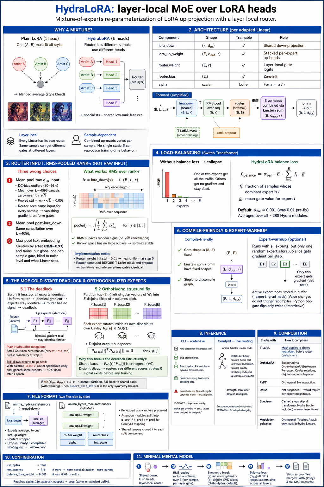

# HydraLoRA: layer-local MoE over LoRA heads

A mixture-of-experts re-parameterization of the LoRA up-projection. Each adapted `Linear` gets a shared `lora_down`, $E$ parallel `lora_up` heads, and a router that emits a per-sample softmax over those heads. The effective up-matrix becomes sample-dependent, so distinct clusters of training samples (different artists, different styles) can push different heads in different directions instead of collapsing into one shared compromise subspace.

> We published a paper about this! Read the [paper](https://arxiv.org/abs/2605.03252) if interested.

Recap from `lora.md`: every target `Linear` $W_0$ is adapted by $y = W_0 x + m \cdot s \cdot B A x$. HydraLoRA keeps $A$ (shared) exactly as before and replaces the single $B$ with $E$ stacked copies plus a routing module that mixes them per sample.



---

## 1. Why a mixture

A plain LoRA trained on multiple distinct styles has to fit all of them through one $(A, B)$ pair. The optimizer's best rank-$r$ compromise captures the common structure — the result reads as a blended average rather than any one style. You see this as "style bleed": muddled in-between looks, distinct artist fingerprints gone.

The MoE fix is structural: keep the low-rank bottleneck, give the up-projection $E$ heads, let a router pick a per-sample mixture. Samples from artist A and artist B get pushed toward different experts, and those experts then receive differentiated gradients. The common features stay in the shared `lora_down`; the style-specific steering lives in the per-expert `lora_up`.

---

## 2. Architecture

Per adapted Linear, `HydraLoRAModule` (`networks/lora_modules/hydra.py`) stores:

| Component         | Shape                                      | Trainable | Role                                         |
| ----------------- | ------------------------------------------ | --------- | -------------------------------------------- |
| `lora_down`       | $(r,\ d_\text{in})$                        | yes       | Shared down-projection                       |
| `lora_up_weight`  | $(E,\ d_\text{out},\ r)$                   | yes       | Stacked per-expert up heads                  |
| `router.weight`   | $(E,\ r)$                                  | yes       | Layer-local gate logits                      |
| `router.bias`     | $(E,)$                                     | yes       | Zero-init                                    |
| `alpha`           | scalar                                     | buffer    | For $s = \alpha/r$                           |

Forward, simplified:

```python
lx       = lora_down(x)                                          # (B, L, r)

pooled   = rms_pool_over_seq(lx)                                 # (B, r)  — §3
gate     = softmax(router(pooled), dim=-1)                       # (B, E)

lx       = lx * timestep_mask                                    # T-LoRA plugs in here
lx, scale = apply_rank_dropout(lx)

combined = einsum("be,eod->bod", gate, lora_up_weight)           # (B, d_out, r)
out      = bmm(lx_3d, combined.transpose(1, 2))                  # (B, L, d_out)

return org_forward(x) + out * multiplier * scale
```

Three properties matter:

- Layer-local. Every adapted Linear has its own router. The same sample can get *different* gate distributions at different layers — specialization is learned per-layer, not as one global "style pick."
- Sample-dependent. `combined` varies per sample via the batch dim of `gate`. There is no single static $B$ that reproduces the trained behavior — averaging experts collapses the router to a uniform prior, which is not what was trained. (This is why merging to the DiT is refused for MoE checkpoints.)
- Cheap router. $r \cdot E + E$ params per module — at $r = 32$, $E = 4$: 132 params, negligible next to the LoRA bank on the same Linear. The gate is computed before the T-LoRA mask and dropout, so routing decisions are identical at train and inference time and never see dropout noise.

---

## 3. The router input: RMS-pooled rank-$r$, not raw input

The router does not read the raw $d_\text{in}$-wide layer input, and does not read the text embedding. It reads the rank-$r$ post-`lora_down` activation, pooled over the sequence dimension with RMS:

$$
\text{pooled}_j\ =\ \sqrt{\ \frac{1}{L}\sum_{\ell=1}^{L}\, \text{lx}_{\ell,j}^2\ }
$$

This choice fell out of three failures worth remembering, because they generalize to any router design on a DiT:

1. Mean-pooling the raw layer input fails twice over: DiT layer inputs carry huge DC-bias outlier channels (peak/mean ~80–96×) that saturate softmax in bf16, and over a ~4000-token sequence, zero-mean activations cancel by $\sqrt{N}$ — the pooled vector is near-identical across samples. The router's gradient vanishes and the balance loss quietly pins every gate to uniform. Measured on early checkpoints: gate entropy flat at 1.0000, router weights never moved from init.
2. Mean-pooling the rank-$r$ activation — same $\sqrt{N}$ cancellation.
3. Max-pooled text embedding (the first design) clusters cleanly by artist and trains — but the route is one-per-sample, broadcast to every layer, blind to noise level and to what the adapted Linear actually sees. Workable, but strictly weaker than layer-local. (This cell still exists on the three-axis surface as `router_source="crossattn_emb"` with a network-level router — see §7.)

RMS fixes both problems at once: squaring before averaging means random signs don't cancel (sample-level content survives long sequences), and the rank-$r$ space is bounded by the jointly-trained `lora_down`, so there are no outliers to saturate bf16 softmax. Router weight init `std=0.01` keeps starting gates near-uniform so every expert receives gradient from step 0.

---

## 4. Load-balancing

Without pressure, training collapses onto one or two experts — the rest never receive gradient. HydraLoRA uses the Switch Transformer balance loss, summed over every module's cached gate:

$$
\mathcal{L}_\text{balance}\ =\ \alpha_\text{bal} \cdot E \cdot \sum_{i=1}^{E} f_i \cdot \bar{g}_i
$$

where $f_i$ is the fraction of samples whose dominant expert at this layer is $i$, and $\bar{g}_i$ the mean gate value for expert $i$.

**Choosing $\alpha_\text{bal}$ is the one knob that can silently ruin a run.** The registry default is 0.01, but benching found the router gradient is tiny relative to it: anything at or above ~1e-4 *saturates* the balance term and squeezes every gate to uniform — the collapse the loss was meant to prevent, from the other direction. The benched safe range is roughly [2e-6, 5e-5]; the configured variants pin it there. Set it explicitly.

---

## 5. The MoE cold-start deadlock

There's a symmetry problem HydraLoRA has to solve before the balance loss can help.

Zero-init `lora_up_weight` makes every expert identical. Under a near-uniform router, all experts receive identical gradient, so they evolve permutation-symmetrically — identical forever, and the router has no signal to differentiate them. End state: a single LoRA paying $E\times$ the parameters. (Two earlier mitigations — random expert-gradient warmup masks, Gaussian init perturbation — were tried and removed; benching showed the real failure mode is router-side. A later structural fix, per-expert disjoint SVD output subspaces via an orthogonalized-expert parameterization ("OrthoHydra"), was implemented and has since been removed from the live tree along with the rest of the OrthoLoRA/OrthoHydra family — the balance loss (§4) is the mitigation that remains.)

---

## 6. File format — two files side by side

`save_weights` produces two outputs:

1. `<name>.safetensors` — standard LoRA (baked-down). Expert ups averaged into a single `lora_up.weight`, routers stripped. Drop-in ComfyUI compatible, but routing is lost — a uniform-prior approximation of the trained network.
2. `<name>_moe.safetensors` — full multi-head format. Per-expert `lora_ups.N.weight`, routers preserved, fused attention projections split into `q/k/v_proj` (via `networks/attn_fuse.py`) so downstream loaders can map ComfyUI attention key names.

The bake-down is a pragmatic compromise: ship as a standard LoRA for anyone without the custom node, keep the moe file lossless for those with it.

Metadata compatibility note: routing config is stamped as `ss_use_moe_style` / `ss_route_per_layer` / `ss_router_source`. Pre-three-axis checkpoints (stamped `ss_use_hydra` / `ss_use_fei_router`) no longer load — the legacy fallback was removed.

---

## 7. The three-axis surface: where HydraLoRA sits in the family

Since the plan2 refactor there is no `use_hydra` flag (passing one raises). The LoRA-family routing collapsed into three orthogonal config axes (`networks/CLAUDE.md` has the full matrix):

| Knob | Values | Meaning |
|---|---|---|
| `use_moe_style` | `False` / `"shared_A"` | no experts / Hydra layout |
| `route_per_layer` | `True` / `False` | per-Linear router vs. one network-level router |
| `router_source` | `"none"` / `"input"` / `"sigma"` / `"fei"` / `"crossattn_emb"` | what the router reads |

The paper-faithful HydraLoRA described in this doc is the cell `("shared_A", true, "input")`. Swapping `router_source` to `"sigma"` or `"fei"` keeps the layout but routes by noise level instead of content; `route_per_layer=false` swaps the per-Linear routers for one network-level `GlobalRouter`. The live `configs/methods/lora.toml` trains no MoE — the routed variants are opt-in via the routing keys, and `configs/gui-methods/hydralora.toml` is the ready-made per-variant file. `cache_llm_adapter_outputs = true` is assumed by the surrounding training plumbing (as for every LoRA config in this repo).

---

## 8. Inference

### CLI — router-live

`inference.py` auto-detects moe files by a safetensors-header sniff. When detected, static merge is skipped and the network attaches as dynamic forward hooks — the training-time `HydraLoRAModule.forward` runs on every adapted layer on every denoising step, reproducing the trained per-sample, per-layer routing. Mixing an moe file with regular LoRA files in one `--lora_weight` list is refused (static merge and router-live are mutually exclusive). `make test-hydra` runs inference against the latest moe output.

### ComfyUI — the custom node

The Anima Adapter Loader node installs per-Linear `forward_hook`s reproducing the module forward exactly, RMS pool and all. It no longer lives in this tree — it was extracted to its own repo (https://github.com/sorryhyun/ComfyUI-Anima_lora-Adapter, standalone checkout at `~/ComfyUI-Anima_lora-Adapter`). Its `CLAUDE.md` documents the hook-not-override invariant that keeps it compile-safe.

---

## 9. Composition

| Stacks with              | How it composes                                                                                  |
| ------------------------ | ------------------------------------------------------------------------------------------------ |
| T-LoRA                   | Mask applies to shared `lora_down` output, after the router already cached its gate.             |
| Spectrum                 | Cached steps skip all transformer blocks (router included) — hydra just runs on fewer steps.     |
| Modulation guidance      | Orthogonal — touches AdaLN only, outside the adapted Linears.                                    |
| Static merge to DiT      | ❌ Sample-dependent gates can't fold into a Linear weight.                                       |

---

## 10. Minimal mental model

1. Shared `lora_down`, stacked per-expert `lora_up`, per-Linear router. On the three-axis surface: `("shared_A", true, "input")`.
2. Router reads RMS-pooled rank-$r$ activation — RMS because mean cancels over long sequences and the raw input's outlier channels break bf16 softmax.
3. The cold-start symmetry break that used to come from disjoint SVD-slice output subspaces per expert (OrthoHydra, structural at init) is gone with that family; the balance loss is what keeps experts alive now — but its weight has a hard ceiling (~1e-4 saturates; run in [2e-6, 5e-5]).
4. Ships as two files: a merged-down plain LoRA (lossy, ComfyUI native) and a `_moe` file (lossless, router-live, needs the custom node).
