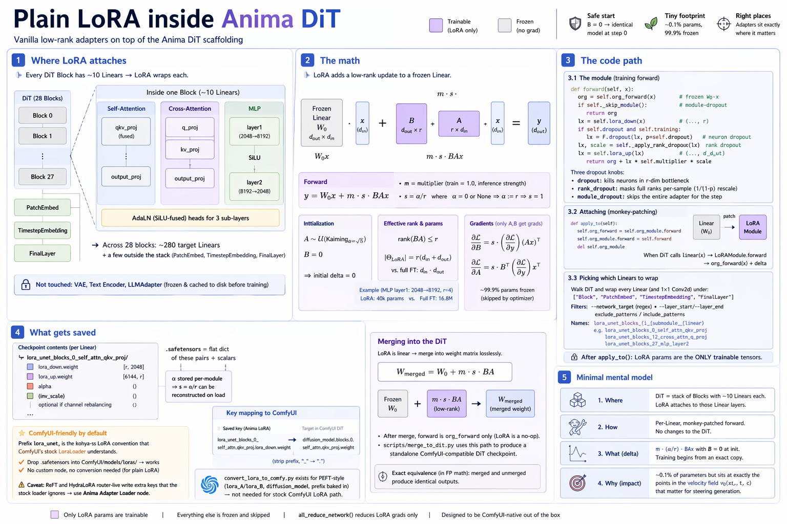

# Plain LoRA inside Anima

How a vanilla low-rank adapter plugs into the Anima DiT. Plain LoRA means *just* the low-rank adapter. All of those stack on top of the scaffolding described here.



---

## 1. Where LoRA attaches

Every DiT block (`library/anima/models.py:962–1223`) contains ~10 `Linear` layers — fused `qkv_proj` and `output_proj` in self-attention; `q_proj`, `kv_proj`, `output_proj` in cross-attention; `layer1` and `layer2` in the MLP; the SiLU-fused AdaLN heads for the three sub-layers. LoRA wraps each of them. Across 28 blocks that is roughly **280 target Linears**, plus a few outside the stack (`PatchEmbed`, `TimestepEmbedding`, `FinalLayer`).

LoRA does **not** touch the VAE, text encoder, or LLMAdapter — those are frozen and, since text embeddings and latents are cached to disk before training starts, they are not even resident in VRAM during the training loop.

---

## 2. The math

LoRA replaces a frozen Linear $W_0 \in \mathbb{R}^{d_\text{out} \times d_\text{in}}$ with an additive low-rank update. Let $r \ll \min(d_\text{in}, d_\text{out})$. Define:

$$
A \in \mathbb{R}^{r \times d_\text{in}}\ (\text{down}),
\qquad
B \in \mathbb{R}^{d_\text{out} \times r}\ (\text{up})
$$

The adapted forward is:

$$
y\ =\ \underbrace{W_0\,x}_{\text{frozen}}\ +\ \underbrace{m \cdot s \cdot B A\,x}_{\text{LoRA delta}}
$$

with scalar **multiplier** $m$ (training = 1.0, inference-time strength) and **scale** $s = \alpha / r$:

$$
s = \frac{\alpha}{r}, \qquad \alpha = 0 \lor \alpha = \text{None} \Rightarrow \alpha := r \Rightarrow s = 1
$$

(`networks/lora_modules/base.py:87–88`).

**Initialization** (`networks/lora_modules/lora.py:57–58`):

$$
A \sim \mathcal{U}\!\left(\text{Kaiming}_{\,a=\sqrt{5}}\right), \qquad B = 0
$$

$B = 0$ makes the initial delta exactly zero, so step 0 reproduces the pretrained model identically — a hard precondition for safe fine-tuning.

**Effective rank.** For input $x \in \mathbb{R}^{d_\text{in}}$:

$$
\operatorname{rank}(B A) \le r, \qquad
|\Theta_{\text{LoRA}}| = r\,(d_\text{in} + d_\text{out})
$$

vs. full fine-tune $d_\text{in}\cdot d_\text{out}$ — e.g. for the MLP `layer1` (2048→8192) at $r=4$: 40k params vs. 16.8M.

**Gradient.** Because $W_0$ is detached, only $A, B$ receive gradient:

$$
\frac{\partial \mathcal{L}}{\partial B} = s\cdot \big(\partial \mathcal{L}/\partial y\big)\,(A x)^\top,
\qquad
\frac{\partial \mathcal{L}}{\partial A} = s\cdot B^\top\big(\partial \mathcal{L}/\partial y\big)\,x^\top
$$

so roughly 99.9% of parameters are frozen and skipped by the optimizer.

---

## 3. The code path

### 3.1 The module

`networks/lora_modules/lora.py:62–94` — the training `forward`:

```python
def forward(self, x):
    org = self.org_forward(x)                     # frozen W0·x

    if self._skip_module():                       # module-dropout
        return org

    lx = self.lora_down(x)                        # (..., r)

    if self.dropout is not None and self.training:
        lx = F.dropout(lx, p=self.dropout)
    lx, scale = self._apply_rank_dropout(lx)      # returns self.scale if off

    lx = self.lora_up(lx)                         # (..., d_out)
    return org + lx * self.multiplier * scale
```

One subtlety worth knowing — **three dropout knobs**: `dropout` kills neurons in the `r`-dim bottleneck; `rank_dropout` masks full ranks per-sample with the standard $1/(1-p)$ rescale; `module_dropout` skips the entire adapter for the step — useful as stochastic regularization across the 280 LoRAs.

### 3.2 Attaching to the model (monkey-patching)

`networks/lora_modules/base.py:115–118`:

```python
def apply_to(self):
    self.org_forward = self.org_module.forward
    self.org_module.forward = self.forward
    del self.org_module
```

The LoRA module captures a reference to the original `forward`, replaces the bound method on the frozen `Linear`, and drops its `org_module` pointer (the `org_forward` closure keeps the real Linear alive via its `self`). When the DiT runs, every patched `Linear` now calls `LoRAModule.forward`, which in turn calls the captured `org_forward(x)` and adds the delta.

**No surgery on the DiT.** The DiT doesn't know LoRA exists — it just calls `linear(x)` as usual and a patched bound method intercepts it.

### 3.3 Picking which Linears to wrap

`networks/lora_anima/network.py` iterates the DiT and wraps every `Linear` (and 1×1 `Conv2d`) found under:

```python
ANIMA_TARGET_REPLACE_MODULE = [
    "Block", "PatchEmbed", "TimestepEmbedding", "FinalLayer",
]
```

For each hit a `LoRAModule` is instantiated with:

```
name = "lora_unet_blocks_{i}_{submodule}_{linear}"
        e.g. lora_unet_blocks_0_self_attn_qkv_proj
             lora_unet_blocks_12_cross_attn_q_proj
             lora_unet_blocks_27_mlp_layer2
```

Filters: `--network_target` regex, `--layer_start`/`--layer_end` (block-index range), `exclude_patterns` / `include_patterns`. These let you constrain plain LoRA to, say, cross-attention only (`*_cross_attn_*`) or just the mid-stack blocks.

After `apply_to()`, LoRA parameters are the **only** trainable tensors. Everything else is frozen.

---

## 4. What gets saved

On checkpoint, each wrapped Linear writes two weights (`networks/lora_save.py`):

```
lora_unet_blocks_0_self_attn_qkv_proj.lora_down.weight    [r, 2048]
lora_unet_blocks_0_self_attn_qkv_proj.lora_up.weight      [6144, r]
lora_unet_blocks_0_self_attn_qkv_proj.alpha               ()          # for s = α/r
...
```

A plain LoRA `.safetensors` is just a flat dict of these pairs plus scalars. Because $\alpha$ is stored per-module, loading can reconstruct $s$ without knowing the training recipe. If channel rebalancing was enabled, an extra `inv_scale` buffer rides along; inference absorbs it back into `lora_down` before merging (`lora.py:141–144`).

### ComfyUI-friendly by default

The `lora_unet_` prefix is not arbitrary — it is the **kohya-ss LoRA convention** that ComfyUI's built-in `LoraLoader` node recognizes natively. No custom node, no conversion step: drop a plain-LoRA `.safetensors` into `ComfyUI/models/loras/` and it loads. The prefix is literally commented as such in `networks/lora_anima/network.py:54` (`LORA_PREFIX_ANIMA = "lora_unet"  # ComfyUI compatible`).

The loader maps keys onto ComfyUI's DiT state dict by stripping `lora_unet_` and swapping underscores back to dots:

```
lora_unet_blocks_0_self_attn_qkv_proj.lora_down.weight
        ↓  (strip prefix, "_" → ".")
diffusion_model.blocks.0.self_attn.qkv_proj.weight   (target in the ComfyUI model)
```

`scripts/convert_lora_to_comfy.py` exists for the *PEFT-style* flavor (`lora_A` / `lora_B` naming, `diffusion_model.` prefix baked in) if a downstream tool needs that, but for the stock ComfyUI LoRA path no conversion is needed. This is also why OrthoLoRA's save pipeline converts its native `S_p` / `S_q` / `λ` / `P_basis` / `Q_basis` back to `lora_up.weight` / `lora_down.weight` / `alpha` on write (see `ortholora.md` §7) — fitting this key schema is what lets it ride the stock loader for free.

Caveat: this applies to **plain weight-patch LoRA only**. ReFT (`reft.md`) and HydraLoRA router-live inference (`hydralora.md`) write extra keys (`reft_*`, `router.*`, stacked `lora_ups.N.*`) that ComfyUI's stock loader silently drops — those variants require the `custom_nodes/comfyui-hydralora/` Anima Adapter Loader node.

### Merging into the DiT

LoRA is a pure **linear** delta on `Linear`s, so it folds into the weight matrix losslessly:

$$
W_\text{merged}\ =\ W_0\ +\ m \cdot s \cdot B A
$$

(`lora.py:147`). After merging, the forward is `org_forward` only — LoRA becomes a no-op. `scripts/merge_to_dit.py` uses exactly this path to produce a standalone ComfyUI-compatible DiT checkpoint.

---

## 5. Minimal mental model

Everything plain LoRA does comes down to four facts:

1. The DiT is a stack of `Block`s whose actual compute is a dozen or so `Linear`s each. LoRA attaches to those.
2. The patch is **per-Linear, monkey-patched `forward`** — no model changes.
3. The delta is $m \cdot (\alpha/r) \cdot BAx$ with $B$ starting at zero, so training begins from an exact copy of the pretrained model.
4. The whole adapter is ~0.1% of the parameters but sits at exactly the points in the velocity field $v_\theta(x_t, t, c)$ that matter for steering generation.
