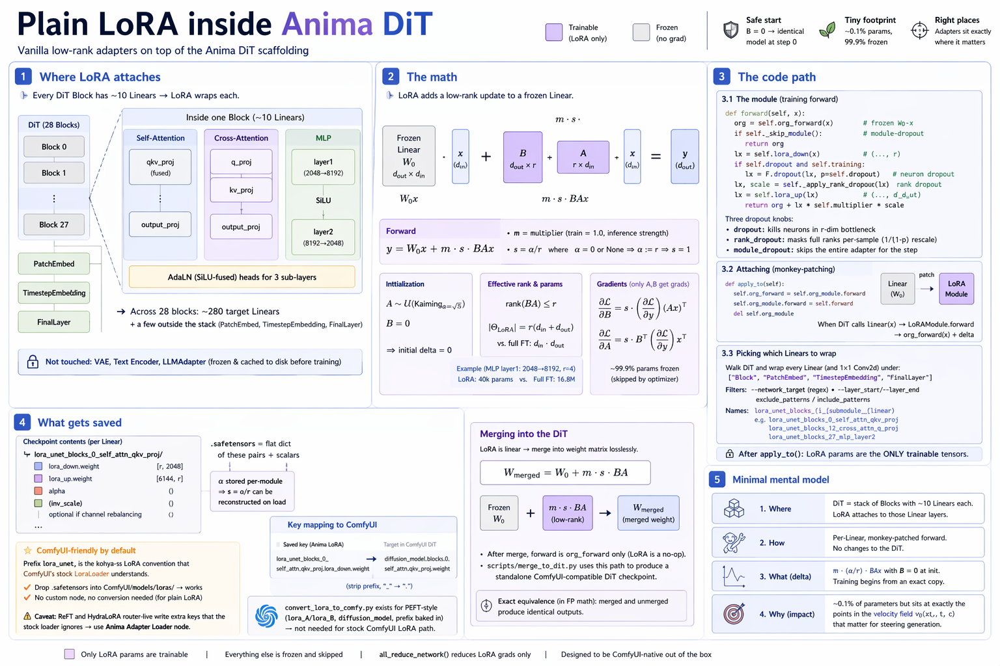

# Plain LoRA inside Anima

How a vanilla low-rank adapter plugs into the Anima DiT. Plain LoRA means just the low-rank adapter — every other member of the family (OrthoLoRA, T-LoRA, HydraLoRA, ChimeraHydra) stacks on top of the scaffolding described here.



---

## 1. Where LoRA attaches

Every DiT block contains ~10 `Linear` layers — fused `qkv_proj` and `output_proj` in self-attention; `q_proj`, `kv_proj`, `output_proj` in cross-attention; `layer1` and `layer2` in the MLP; the AdaLN heads for the three sub-layers. LoRA wraps each of them. Across 28 blocks that is roughly 280 target Linears, plus a few outside the stack (`PatchEmbed`, `TimestepEmbedding`, `FinalLayer`).

LoRA does not touch the VAE, text encoder, or LLMAdapter — those are frozen and, since text embeddings and latents are cached to disk before training starts, they are not even resident in VRAM during the training loop.

---

## 2. The math

LoRA replaces a frozen Linear $W_0 \in \mathbb{R}^{d_\text{out} \times d_\text{in}}$ with an additive low-rank update. Let $r \ll \min(d_\text{in}, d_\text{out})$. Define:

$$
A \in \mathbb{R}^{r \times d_\text{in}}\ (\text{down}),
\qquad
B \in \mathbb{R}^{d_\text{out} \times r}\ (\text{up})
$$

The adapted forward is:

$$
y\ =\ \underbrace{W_0\,x}_{\text{frozen}}\ +\ \underbrace{m \cdot s \cdot B A\,x}_{\text{LoRA delta}}
$$

with scalar multiplier $m$ (training = 1.0, inference-time strength) and scale $s = \alpha / r$ (an unset $\alpha$ defaults to $r$, i.e. $s = 1$).

Initialization. The classic scheme is Kaiming-uniform for $A$, zeros for $B$ — $B = 0$ makes the initial delta exactly zero, so step 0 reproduces the pretrained model identically, a hard precondition for safe fine-tuning. The live config (`configs/methods/lora.toml`) additionally sets `down_init = "weight_svd"` (SVD-Down): $A$ is seeded from the pretrained weight's top-$r$ right singular vectors, scaled by $1/\sqrt{3}$ to match Kaiming's expected row-norm so the change is purely *direction*, not step size. The delta still starts at exactly zero (via $B = 0$) and everything stays ordinary LoRA afterwards — the first gradients just land in a subspace $W_0$ already cares about. This is the shipped, lightweight member of the SVD-warm-start family (`ortholora.md` compares it with its stricter siblings; deep-dive in `docs/methods/svd-down-lora.md`).

Parameter count. $|\Theta_{\text{LoRA}}| = r\,(d_\text{in} + d_\text{out})$ vs. full fine-tune $d_\text{in}\cdot d_\text{out}$ — e.g. for the MLP `layer1` (2048→8192) at $r=4$: 40k params vs. 16.8M. Because $W_0$ is detached, only $A, B$ receive gradient, so roughly 99.9% of parameters are frozen and skipped by the optimizer.

---

## 3. The code path

### 3.1 The module

All LoRA-family variants share one forward template (`networks/lora_modules/base.py::BaseLoRAModule`); each variant only supplies its own `_down` / `_up` projections. For plain LoRA (`networks/lora_modules/lora.py`) the training forward is, in order:

```
org = org_forward(x)          # frozen W0·x
if module-dropout hit: return org
lx  = lora_down(x)            # (..., r)
lx  = lx * timestep_mask      # T-LoRA gate — identity unless enabled
lx  = dropout(lx)             # bottleneck-neuron dropout
lx, scale = rank_dropout(lx)  # per-sample rank masking
lx  = lora_up(lx)             # (..., d_out)
return org + lx * multiplier * scale
```

Note the T-LoRA gate sits first in the bottleneck, before either dropout — routing- and schedule-level decisions never see dropout noise.

Three distinct dropout knobs: `dropout` kills neurons in the `r`-dim bottleneck; `rank_dropout` masks full ranks per-sample with the standard $1/(1-p)$ rescale; `module_dropout` skips the entire adapter for the step — stochastic regularization across the 280 LoRAs.

Dtype. The rank GEMMs run in the model compute dtype, keyed off `org_forwarded.dtype` (not the input's — AdaLN's LayerNorm hands fp32 inputs under bf16 autocast). See `anima-optimizations.md` §2.3 for why this replaced the old fp32 bottleneck.

### 3.2 Attaching to the model (monkey-patching)

```python
def apply_to(self):
    self.org_forward = self.org_module.forward
    self.org_module.forward = self.forward
    del self.org_module
```

The LoRA module captures a reference to the original `forward`, replaces the bound method on the frozen `Linear`, and drops its `org_module` pointer (the `org_forward` closure keeps the real Linear alive via its `self`). When the DiT runs, every patched `Linear` now calls `LoRAModule.forward`, which calls the captured `org_forward(x)` and adds the delta.

**No surgery on the DiT.** The DiT doesn't know LoRA exists — it just calls `linear(x)` as usual and a patched bound method intercepts it. (This is also why compile ordering matters: `torch.compile` must trace the *patched* forward, so `compile_blocks()` runs after `apply_to` — the compile-after-apply invariant in `library/runtime/harness.py::build_anima`.)

### 3.3 Picking which Linears to wrap

`networks/lora_anima/network.py` iterates the DiT and wraps every `Linear` (and 1×1 `Conv2d`) found under:

```python
ANIMA_TARGET_REPLACE_MODULE = [
    "Block", "PatchEmbed", "TimestepEmbedding", "FinalLayer",
]
```

Each hit gets a `LoRAModule` named by its path:

```
lora_unet_blocks_0_self_attn_qkv_proj
lora_unet_blocks_12_cross_attn_q_proj
lora_unet_blocks_27_mlp_layer2
```

Filters (set as `network_args`): `include_patterns` / `exclude_patterns` are regexes matched with `re.fullmatch` against the module name, and `layer_start`/`layer_end` bound the block-index range — e.g. constrain a run to cross-attention only (`.*_cross_attn_.*`) or just the mid-stack blocks.

After `apply_to()`, LoRA parameters are the only trainable tensors.

### 3.4 What the default config actually trains

The live `configs/methods/lora.toml` stacks plain LoRA with T-LoRA (`use_timestep_mask = true` — see `timestep-mask.md`), the weight-SVD down init above, and the REPA auxiliary alignment loss. OrthoLoRA and the MoE variants are opt-in: `use_ortho = true` / `use_ortho_init = true` for the ortho parameterizations, and the three-axis surface (`use_moe_style` / `route_per_layer` / `router_source` — see `networks/CLAUDE.md`) for the routed variants. The old boolean toggles (`use_hydra`, `use_fei_router`) were removed and now raise if passed.

---

## 4. What gets saved

On checkpoint, each wrapped Linear writes two weights plus a scalar (`networks/lora_save.py`):

```
lora_unet_blocks_0_self_attn_qkv_proj.lora_down.weight    [r, 2048]
lora_unet_blocks_0_self_attn_qkv_proj.lora_up.weight      [6144, r]
lora_unet_blocks_0_self_attn_qkv_proj.alpha               ()          # for s = α/r
```

A plain LoRA `.safetensors` is just a flat dict of these triples. Because $\alpha$ is stored per-module, loading reconstructs $s$ without knowing the training recipe. If channel rebalancing was enabled, an extra `inv_scale` buffer rides along; inference absorbs it back into `lora_down` before merging.

### ComfyUI-friendly by default

The `lora_unet_` prefix is the kohya-ss LoRA convention that ComfyUI's built-in `LoraLoader` node recognizes natively. No custom node, no conversion step: drop a plain-LoRA `.safetensors` into `ComfyUI/models/loras/` and it loads. The loader maps keys onto ComfyUI's DiT state dict by stripping the prefix and swapping underscores back to dots:

```
lora_unet_blocks_0_self_attn_qkv_proj.lora_down.weight
        ↓  (strip prefix, "_" → ".")
diffusion_model.blocks.0.self_attn.qkv_proj.weight
```

One wrinkle: the runtime DiT uses *fused* `qkv_proj`/`kv_proj` while the on-disk convention wants split `q/k/v_proj` — `networks/attn_fuse.py` owns that mapping, applied on save and undone on load.

This key schema is also why OrthoLoRA converts its native Cayley state back to `lora_up.weight` / `lora_down.weight` / `alpha` on save (`ortholora.md` §4) — fitting the schema is what lets it ride the stock loader for free.

Caveat: plain weight-patch LoRA only. HydraLoRA router-live inference (`hydralora.md`) writes extra keys (`router.*`, stacked `lora_ups.N.*`) that ComfyUI's stock loader silently drops — those variants need the Anima Adapter Loader custom node.

### Merging into the DiT

LoRA is a pure linear delta on `Linear`s, so it folds into the weight matrix losslessly:

$$
W_\text{merged}\ =\ W_0\ +\ m \cdot s \cdot B A
$$

After merging, the forward is `org_forward` only — LoRA becomes a no-op. `scripts/toolkits/merge_to_dit.py` uses exactly this path to produce a standalone ComfyUI-compatible DiT checkpoint. (Router-dependent variants can't merge — a sample-dependent gate has no single static $BA$.)

---

## 5. Minimal mental model

1. The DiT's actual compute is ~280 `Linear`s. LoRA attaches to those, and only those.
2. The patch is per-Linear, monkey-patched `forward` — no model changes, which is also why compile must happen after attach.
3. The delta is $m \cdot (\alpha/r) \cdot BAx$ with $B$ starting at zero, so training begins from an exact copy of the pretrained model; `down_init="weight_svd"` additionally aims the first gradients at $W_0$'s principal subspace.
4. The whole adapter is ~0.1% of the parameters but sits at exactly the points in the velocity field $v_\theta(x_t, t, c)$ that matter for steering generation.
