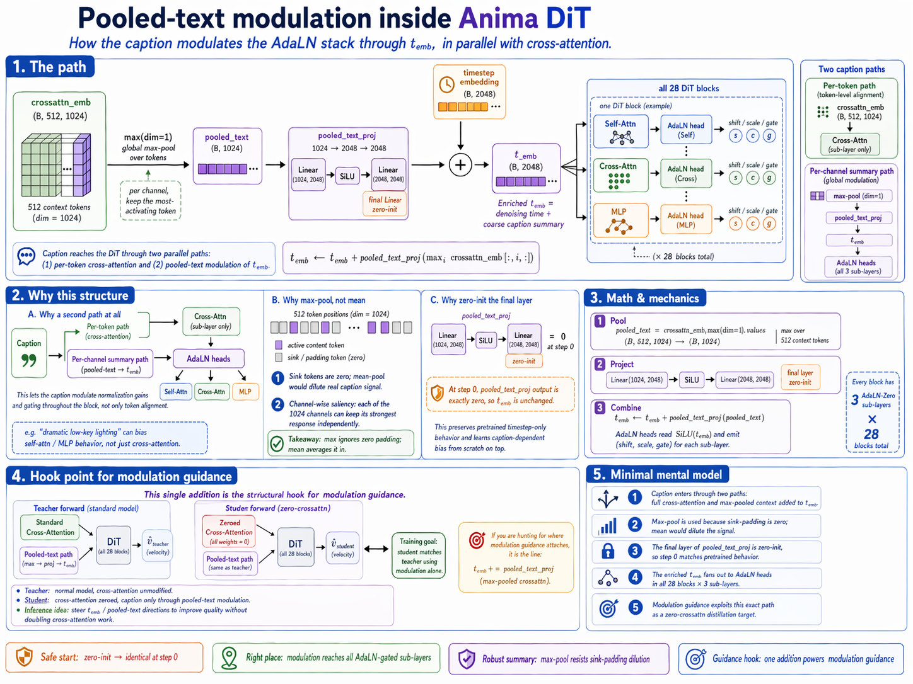

# Pooled-text modulation

How the caption conditions Anima's AdaLN stack. In parallel with cross-attention, a **max-pooled** summary of `crossattn_emb` is added to the timestep embedding `t_emb` before that vector fans out to every block's AdaLN head.

Recap from `anima.md`: `crossattn_emb ∈ ℝ^{B×512×1024}` is what every DiT block's cross-attention sees (produced by the LLMAdapter, §2.3). Each block also has three AdaLN-Zero sub-layers, each gated by a `(shift, scale, gate)` triple computed from `SiLU(t_emb)` (§4). Pooled-text modulation is how the caption influences that `t_emb` — in parallel with cross-attention, not replacing it.



---

## 1. The path

```
crossattn_emb  (B, 512, 1024)
       │
       ▼
  max(dim=1)                           # (B, 1024)
       │
       ▼
  pooled_text_proj                     # MLP: 1024 → 2048 → 2048 (final zero-init)
       │
       ▼
   (added to)  t_emb  (B, 2048)
       │
       ▼
  [every block × 3 sub-layers × AdaLN head]
```

Three pieces fully specify it.

**Pool** (`library/anima/models.py:1636`):

```python
pooled_text = crossattn_emb.max(dim=1).values   # (B, 1024)
```

Global **max-pool** over the 512 context tokens — per channel, pick the most-activating token.

**Project** (`library/anima/models.py:1345–1349`):

```python
self.pooled_text_proj = nn.Sequential(
    nn.Linear(1024, 2048),   # context_dim → model_dim
    nn.SiLU(),
    nn.Linear(2048, 2048),   # ← zero-initialized
)
```

A small MLP that lifts `1024 → 2048`. The **final Linear's weight and bias are zero-initialized**, so at step 0 the MLP output is exactly zero.

**Combine**:

$$
t_\text{emb}\ \leftarrow\ t_\text{emb}\ +\ \text{pooled\_text\_proj}\!\big(\max_i \text{crossattn\_emb}[:,i,:]\big)
$$

One addition. `t_emb` now encodes *"where we are in denoising"* **plus** *"what the caption is about, at a coarse scalar-per-channel level"*. This enriched `t_emb` is what every AdaLN head (3 per sub-layer × 3 sub-layers × 28 blocks) reads.

---

## 2. Why this structure

### Why a second path at all

Cross-attention can, in principle, carry all the conditioning — but it only affects the **cross-attn sub-layer**. AdaLN gates **all three** sub-layers (self-attn, cross-attn, MLP). Feeding the caption into `t_emb` gives it a way to modulate the other two sub-layers' shift/scale/gate triples without having to route through cross-attention first.

Concretely: a caption like "dramatic low-key lighting" should be able to shift the self-attention's normalization gain or the MLP's nonlinearity strength, not just nudge the cross-attention alignment. The pooled-text path is the mechanism.

### Why max-pool (not mean)

Two reasons:

1. **Sink tokens are zero.** Most of the 512 positions in `crossattn_emb` are attention-sink padding (see `anima.md` §2.4 for why that padding is load-bearing). Mean-pool would dilute the real caption signal by ~10:1 depending on caption length — zeros contribute to the sum but not to information. Max-pool ignores them and picks the most-activating content per channel.
2. **Channel-wise saliency.** For a 1024-dim context, different channels light up on different aspects of the caption (composition, color, subject, style). Max per channel captures the peak response for each aspect independently, rather than averaging them together.

### Why zero-init the final layer

Classic AdaLN-Zero convention. At step 0 the MLP output is exactly zero → `t_emb` is unchanged → AdaLN modulation is the pure timestep-only form. The pretrained DiT already works in that form (it was trained with whatever `pooled_text_proj` it shipped with); zero-init means any learned contribution is added from scratch without regressing the base.

Training then learns what **caption-dependent bias** to add to the AdaLN gains, per channel, on top of the timestep-only default.

---

## 3. Hook point for modulation guidance

This is the structural hook point for **modulation guidance** (Starodubcev et al., ICLR 2026; distilled via `make distill-mod`, see `docs/methods/mod-guidance.md`). The distillation trick:

- **Teacher forward**: standard cross-attention, unmodified.
- **Student forward**: **zeroed cross-attention**, but receives pooled text through the modulation path shown above.

The student learns to produce teacher-quality velocity predictions from modulation alone. At inference, steering `t_emb` along quality-positive directions in pooled-text space then moves AdaLN coefficients toward better outputs — a lightweight CFG-replacement that doesn't require running cross-attention twice.

All of that infrastructure lives on the single `t_emb += pooled_text_proj(max-pooled crossattn)` addition. If you're hunting for where modulation guidance attaches, that line is it.

---

## 4. Minimal mental model

1. The caption reaches the DiT through **two** paths: full cross-attention (per-token) and max-pooled context fed into `t_emb` (per-channel scalar summary).
2. Max-pool because sink-padding is zero — mean would dilute.
3. Final layer of `pooled_text_proj` is zero-init → the pretrained model runs identically at step 0; caption-to-AdaLN influence is learned from scratch on top.
4. Output rides into AdaLN via `t_emb`, fanning out to all 28 blocks × 3 sub-layers.
5. Modulation guidance exploits this exact path as a zero-crossattn distillation target.
