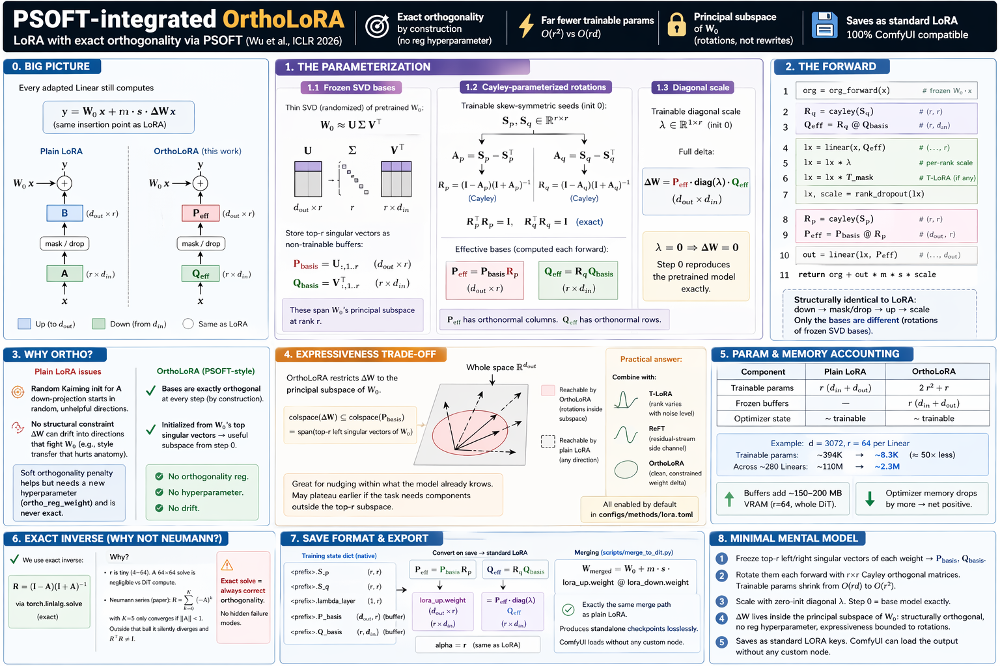

# PSOFT-integrated OrthoLoRA

A re-parameterization of the LoRA delta that keeps the basis matrices **exactly orthogonal** at every training step, initializes them from the pretrained weight's SVD, and swaps the $O(rd)$ trainable bases for two tiny $r \times r$ skew-symmetric seeds. Inspired by PSOFT (Wu et al., *Efficient Orthogonal Fine-Tuning with Principal Subspace Adaptation*, ICLR 2026).

Recap from `lora.md`: plain LoRA replaces a frozen `Linear` $W_0$ with a residual $y = W_0 x + m\,s\,B A x$, $A \in \mathbb{R}^{r \times d_\text{in}}$ down, $B \in \mathbb{R}^{d_\text{out} \times r}$ up, both trainable. OrthoLoRA keeps the same insertion point — every adapted Linear still sees `org_forward(x) + delta` — but re-shapes what $A$ and $B$ actually are so that the delta stays inside an orthonormal subspace of the pretrained weight.



---

## 1. Why rewrite the bases

Two weaknesses of vanilla LoRA motivate the change:

1. **Random Kaiming init for $A$.** The down-projection starts aimed at a direction unrelated to anything the base model cares about. Training spends its first few epochs finding a useful subspace from scratch.
2. **No structural constraint on the delta.** $BA$ can drift into directions that fight the pretrained weight — a classic symptom is style transfer that also degrades anatomy, because the delta is rewriting weights it shouldn't need to touch.

A soft orthogonality penalty ($\|A A^\top - I\|^2 + \|B^\top B - I\|^2$ on the bases) is the cheap fix. It works but it has its own cost:

- A new hyperparameter, `ortho_reg_weight`, sitting on the Pareto front between "orthogonality satisfied" and "task loss minimized." Too low and the bases drift off-orthonormal mid-training; too high and the reg term dominates the task gradient.
- The penalty is never *exact* — at any step the bases are only approximately orthonormal.

The PSOFT-style fix is to move orthogonality from the loss to the parameterization itself.

---

## 2. The parameterization

### 2.1 Frozen SVD bases

Compute the thin SVD of the pretrained weight (randomized, `torch.svd_lowrank`, $\sim 10$–$100{\times}$ faster than full SVD for $r \ll \min(d_\text{in}, d_\text{out})$):

$$
W_0\ \approx\ U\,\Sigma\,V^\top,\qquad
U \in \mathbb{R}^{d_\text{out} \times r},\ \ V \in \mathbb{R}^{d_\text{in} \times r}
$$

Store the top-$r$ singular vectors as **non-trainable buffers**:

$$
P_\text{basis}\ \leftarrow\ U_{:,\,1..r}\quad (d_\text{out}\times r),\qquad
Q_\text{basis}\ \leftarrow\ V_{:,\,1..r}^{\top}\quad (r\times d_\text{in})
$$

`networks/lora_modules/ortho.py:58–73`. These are the pretrained weight's **principal subspace** at rank $r$ — the directions where $W_0$'s row and column activity is concentrated.

### 2.2 Cayley-parameterized rotations

The trainable parameters are two *tiny* skew-symmetric seeds:

$$
S_p,\ S_q\ \in\ \mathbb{R}^{r\times r}, \qquad \text{initialized to 0}
$$

Each is run through the **Cayley transform** to produce an orthogonal matrix:

$$
A_\star\ =\ S_\star - S_\star^\top\qquad\text{(skew-symmetric)}\\[2pt]
R_\star\ =\ (I - A_\star)\,(I + A_\star)^{-1}\quad\Rightarrow\quad R_\star^\top R_\star\ =\ I
$$

(`ortho.py:87–93`). The effective bases are computed each forward pass:

$$
P_\text{eff}\ =\ P_\text{basis}\,R_p\quad (d_\text{out}\times r),\qquad
Q_\text{eff}\ =\ R_q\,Q_\text{basis}\quad (r\times d_\text{in})
$$

Because $P_\text{basis}$ already has orthonormal columns and $R_p$ is orthogonal, $P_\text{eff}$ also has orthonormal columns. Same for $Q_\text{eff}$'s rows. **Orthogonality is structural, not regularized** — it holds exactly at every step, for every sample, regardless of training dynamics.

At init $S_p = S_q = 0 \Rightarrow R_\star = I \Rightarrow P_\text{eff} = P_\text{basis}$, $Q_\text{eff} = Q_\text{basis}$.

### 2.3 The diagonal scale

One more trainable piece — a row vector $\lambda \in \mathbb{R}^{1\times r}$, zero-initialized (`ortho.py:81`). The full delta is:

$$
\Delta W\ =\ P_\text{eff}\,\text{diag}(\lambda)\,Q_\text{eff}\ \in\ \mathbb{R}^{d_\text{out}\times d_\text{in}}
$$

$\lambda = 0$ at init means $\Delta W = 0$, exactly — step 0 reproduces the pretrained model identically, same as plain LoRA's $B = 0$ convention.

---

## 3. The forward

The adapted Linear (`ortho.py:95–129`):

```python
def forward(self, x):
    org = self.org_forward(x)                 # frozen W0·x
    if self._skip_module():
        return org

    R_q   = cayley(self.S_q)                  # (r, r)
    Q_eff = R_q @ self.Q_basis                # (r, d_in)

    lx = F.linear(x, Q_eff)                   # (..., r)
    lx = lx * self.lambda_layer               # per-rank scale
    if self._timestep_mask is not None:       # T-LoRA plugs in here
        lx = lx * self._timestep_mask
    lx, scale = self._apply_rank_dropout(lx)

    R_p   = cayley(self.S_p)                  # (r, r)
    P_eff = self.P_basis @ R_p                # (d_out, r)
    out   = F.linear(lx, P_eff)               # (..., d_out)

    return org + (out * self.multiplier * scale).to(org.dtype)
```

Compared to plain LoRA's `lora_down → mask → lora_up` the structure is identical — what changed is that `lora_down`'s weight is now $R_q\,Q_\text{basis}$ (a rotation of a frozen matrix) and `lora_up`'s is $P_\text{basis}\,R_p$. Everything else — dropout, rank dropout, timestep masking, `multiplier · scale` — sits in the same place.

---

## 4. Exact inverse, not Neumann series

The PSOFT paper computes $R = (I + A)^{-1}(I - A)$ via a $K$-term Neumann series (stopping at $K=5$). We use `torch.linalg.solve(I + A, I - A)` — an **exact inverse** (`ortho.py:93`).

Two reasons:

- **Cost is negligible.** $r$ is 4 to 64. A $64 \times 64$ solve is a rounding-error fraction of the DiT block's compute; at $r = 4$ it's essentially free.
- **Correctness is always.** The Neumann series only converges when $\|A\| < 1$. Outside that ball it silently *diverges* — the output still has a numerical value, but it is not close to the Cayley transform and $R^\top R \ne I$. Since $\|A\|$ grows as training rotates farther from init, hitting this regime is a live possibility. The exact solve just works.

---

## 5. Parameter and memory accounting

For a target Linear with $d_\text{in}$, $d_\text{out}$, rank $r$:

| Component         | Plain LoRA                     | OrthoLoRA                                            |
| ----------------- | ------------------------------ | ---------------------------------------------------- |
| Trainable params  | $r\,(d_\text{in} + d_\text{out})$       | $2r^2 + r$                                           |
| Frozen buffers    | —                              | $r\,(d_\text{in} + d_\text{out})$ (the SVD bases)    |
| Optimizer state   | $\sim$ trainable               | $\sim$ trainable                                     |

Concrete: $d = 3072$, $r = 64$ → trainable drops from ${\sim}394\text{K}$ to ${\sim}8.3\text{K}$ per module. Across ~280 adapted Linears that's ~110M → ~2.3M trainable params — a ~50× reduction in what the optimizer has to carry.

The trade: frozen buffers now hold a per-module copy of the SVD bases (same size as plain LoRA's full trainable weight). `P_\text{eff}$ and `Q_\text{eff}` are *computed* tensors — not leaf parameters — so they sit in the autograd graph as activations. Net VRAM overhead vs. plain LoRA at matched rank: roughly **+150–200 MB** at $r=64$ across the whole DiT. Optimizer memory goes *down* by more than that, so the sum is a small net positive.

---

## 6. The expressiveness trade-off

This is the load-bearing caveat, and it's why the config flag is called `use_ortho` rather than something more declarative — there's a real benchmark happening here.

$P_\text{eff}$ can only rotate within the column space of $P_\text{basis}$. The whole $\Delta W$ is therefore restricted to **rotations inside the principal subspace of $W_0$**:

$$
\text{colspace}(\Delta W)\ \subseteq\ \text{colspace}(P_\text{basis})\ =\ \text{top-}r\ \text{left singular vectors of}\ W_0
$$

Plain LoRA, by contrast, can set $\Delta W$ to point **anywhere** — $B$ and $A$ are free $d_\text{in} \cdot r$ and $r \cdot d_\text{out}$ matrices, learnable in the full space.

This is a well-motivated restriction for NLP fine-tuning, where the pretrained model already "knows" the task domain and you want to nudge it inside that domain. It is a more open question for **creative fine-tuning**: a new character or art style might need a $\Delta W$ component outside the top-$r$ singular directions of $W_0$. If that's the case, OrthoLoRA will plateau earlier than plain LoRA at the same rank. The Cayley guarantee is bought at the cost of basis freedom.

The practical answer has been to stack it with T-LoRA and ReFT — T-LoRA gives the bottleneck rank room to specialize by noise level, ReFT provides an unconstrained residual-stream side-channel, and the OrthoLoRA weight delta handles what fits inside the principal subspace cleanly. `configs/methods/lora.toml` enables all three by default for exactly this reason.

---

## 7. Save format

Training state dict carries the *native* keys:

```
<prefix>.S_p           # (r, r)
<prefix>.S_q           # (r, r)
<prefix>.lambda_layer  # (1, r)
<prefix>.P_basis       # (d_out, r)   — frozen buffer
<prefix>.Q_basis       # (r, d_in)    — frozen buffer
```

On save, the native form is converted to **standard LoRA** (`lora_up.weight`, `lora_down.weight`, `alpha`) for ComfyUI compatibility. The conversion is exact — the effective delta $\Delta W = P_\text{eff}\,\text{diag}(\lambda)\,Q_\text{eff}$ is already rank $r$, so it factors directly with no SVD:

$$
\text{lora\_up}\ =\ P_\text{eff}\cdot\text{diag}(\lambda),\qquad
\text{lora\_down}\ =\ Q_\text{eff}
$$

`scripts/merge_to_dit.py` can fold this into the DiT weight the same way it folds plain LoRA — $W_\text{merged} = W_0 + m \cdot s \cdot \text{lora\_up} \cdot \text{lora\_down}$ — so OrthoLoRA produces standalone checkpoints losslessly.

---

## 8. Minimal mental model

1. Freeze the top-$r$ left/right singular vectors of each adapted weight. Those become `P_basis` and `Q_basis`.
2. Rotate them each forward with $r \times r$ Cayley-parameterized orthogonal matrices. Trainable params shrink from $O(rd)$ to $O(r^2)$.
3. Scale with a zero-init diagonal $\lambda$. Step 0 reproduces the base model exactly.
4. The delta lives **inside the principal subspace of $W_0$** — structurally orthogonal, no reg hyperparameter, but expressiveness is bounded to rotations within that subspace.
5. Saves as standard LoRA keys. ComfyUI can load the output without any custom node.
