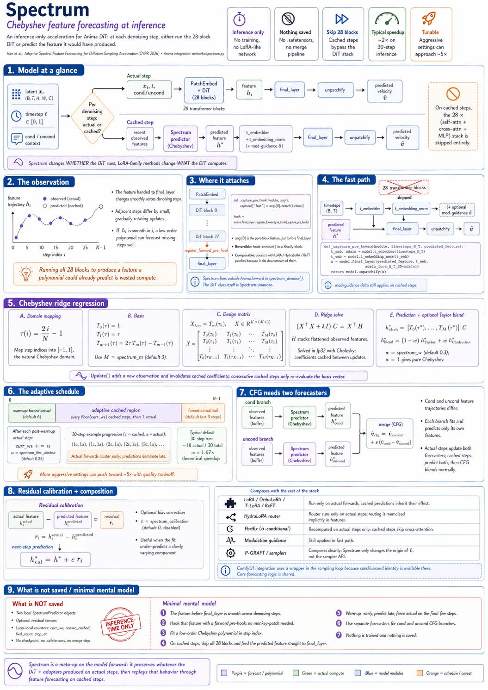

# Spectrum: Chebyshev feature forecasting at inference

An **inference-only** acceleration. No LoRA-like network, no trained weights, no saved tensors — just a decision made once per denoising step: *run the DiT, or predict what it would have produced.* When the decision is "predict," the 28 transformer blocks are skipped and only the tiny heads at the end of the model run. Typical speedup on 30-step inference is ~2×, with tuning up to ~5×.

Reference: Han et al., *Adaptive Spectral Feature Forecasting for Diffusion Sampling Acceleration*, CVPR 2026. Upstream repo: https://github.com/yangheng95/Spectrum. Anima's integration lives in `networks/spectrum.py`.

This sits one layer above the LoRA family (`lora.md`, `ortholora.md`, `hydralora.md`, `reft.md`, `timestep-mask.md`). Those all modify *what* the DiT computes at each step; Spectrum modifies *whether* the DiT runs at this step at all.



---

## 1. The observation

The DiT produces a feature $h_i \in \mathbb{R}^{B \times T \times H \times W \times D}$ at every step $i \in [0, N)$ — specifically the tensor that the stack of 28 blocks hands to `final_layer`, just before the AdaLN projection back to latent space. Across a denoising trajectory, $h_i$ is **not** a random sequence of tensors. It's a smooth function of the step index: adjacent $h_i$ differ by a small, gradually rotating update, because the velocity field the DiT learned is continuous in $t$ and the noisy input $x_t$ evolves continuously under the sampler.

If $i \mapsto h_i$ is smooth in $i$, then a cheap polynomial fit against a handful of observed $h_i$ values should predict the unobserved ones well. Running all 28 blocks to produce a feature a polynomial could have told you is wasted compute. That's the entire idea.

---

## 2. Where it attaches

Not via monkey-patch. A single **forward pre-hook** on `final_layer` (`networks/spectrum.py:292`):

```python
def _capture_pre_hook(module, args):
    captured["feat"] = args[0].detach().clone()

hook = anima.final_layer.register_forward_pre_hook(_capture_pre_hook)
```

`args[0]` is whatever was about to be fed into `final_layer` — i.e., the output of the last DiT block after static unpadding. Every actual forward populates `captured["feat"]`; the denoise loop then reads that, updates the Chebyshev forecaster, and optionally uses it to construct a residual-calibration bias (§8).

Two reasons to hook rather than patch:

- **Reversible.** The hook returns in a `finally` block via `hook.remove()` — inference can flip Spectrum on and off with no state left behind on the model object.
- **Composable.** Forward pre-hooks coexist with whatever `forward`-replacing LoRA / HydraLoRA / ReFT have already patched into the DiT's submodules. Spectrum does not care that those patches exist — it sees only the post-block feature, which is downstream of all adapter effects.

The skip logic happens outside `Anima.forward`: the denoise loop in `spectrum_denoise()` (`spectrum.py:220–448`) calls `anima(...)` on actual steps and `_spectrum_fast_forward(...)` on cached steps. The DiT class itself has no Spectrum-awareness.

### 2.1 The fast path

On a cached step, the 28 transformer blocks are skipped entirely. Only the head/tail of the model runs (`spectrum.py:206–217`):

```python
def _spectrum_fast_forward(model, timesteps_B_T, predicted_feature):
    t_emb, adaln = model.t_embedder(timesteps_B_T)
    t_emb = model.t_embedding_norm(t_emb)
    if getattr(model, "_mod_guidance_delta", None) is not None:
        t_emb = t_emb + model._mod_guidance_delta.unsqueeze(1)
    x = model.final_layer(predicted_feature, t_emb, adaln_lora_B_T_3D=adaln)
    return model.unpatchify(x)
```

That's it — `t_embedder` (a tiny MLP on the scalar timestep), `t_embedding_norm`, optional mod-guidance delta (`mod-guidance.md`), `final_layer` (LayerNorm + AdaLN + linear projection back to patch space), `unpatchify`. The 28 × `self_attn + cross_attn + MLP` stack — which is 99% of the model's FLOPs — is entirely bypassed. The predicted $h^\star$ goes straight into `final_layer` as if it had come from the block stack.

---

## 3. Chebyshev ridge regression

`ChebyshevForecaster` (`spectrum.py:45–154`). For a window of $K \le $ some cap observations $\{(i_k, h_{i_k})\}$, build a design matrix from Chebyshev polynomials of the first kind.

### 3.1 Domain mapping

Step indices are mapped to $\tau \in [-1, 1]$, the natural domain for Chebyshev $T_m$:

$$
\tau(i)\ =\ 2\,\frac{i}{N}\ -\ 1
$$

($N$ is total denoising steps.) The mapping preserves order, and $\tau \in [-1, 1]$ is where $|T_m(\tau)| \le 1$ holds — extrapolation outside that range blows up in polynomial magnitude, so the forecaster is designed to interpolate/short-extrapolate within the denoising trajectory, not beyond it.

### 3.2 Design matrix

Chebyshev polynomials of the first kind, built by the three-term recurrence:

$$
T_0(\tau) = 1,\qquad T_1(\tau) = \tau,\qquad T_{m+1}(\tau) = 2\,\tau\,T_m(\tau) - T_{m-1}(\tau)
$$

(`spectrum.py:87–99`). Design matrix is $X \in \mathbb{R}^{K \times (M+1)}$ with $X_{k,m} = T_m(\tau_k)$, where $M$ is `spectrum_m` (default 3, giving a cubic basis $\{T_0, T_1, T_2, T_3\}$).

### 3.3 Ridge regression via Cholesky

Flatten each $h_{i_k}$ to a 1-D vector of length $F = B \cdot T \cdot H \cdot W \cdot D$, stack into $H \in \mathbb{R}^{K \times F}$, and solve the $\ell_2$-regularized normal equations per feature column:

$$
(X^\top X + \lambda I_{M+1})\,C\ =\ X^\top H
$$

Anima solves this with **Cholesky** (`spectrum.py:137–144`): $X^\top X + \lambda I$ is $(M+1)\times(M+1)$, SPD by construction, and $M+1$ is 4–5, so the factorization is free. $C \in \mathbb{R}^{(M+1) \times F}$ holds the per-feature polynomial coefficients. A jitter fallback $+\varepsilon \cdot \text{mean}(\text{diag})$ reattempts the Cholesky if it fails — a safety net that rarely fires at $M = 3$.

The solve runs in **fp32** even though the stored features and returned coefficients are bf16; small Gram matrices are the last place you want to eat bf16 precision loss, and the cost is irrelevant.

### 3.4 Prediction

At a cached step $i^\star$:

$$
h^\star\ =\ \big[\,T_0(\tau^\star),\ T_1(\tau^\star),\ \dots,\ T_M(\tau^\star)\,\big]\cdot C
\quad\in\mathbb{R}^{1 \times F}
$$

Reshape back to the original feature shape and feed into the fast path. The coefficient matrix $C$ is cached across consecutive cached steps (invalidated only when `update()` adds a new observation, `spectrum.py:123`), so multiple cached steps in a row only re-evaluate the basis vector — no resolve.

### 3.5 Optional Taylor blend

`SpectrumPredictor` (`spectrum.py:162–203`) wraps the Chebyshev forecaster and blends in a **first-order discrete Newton forward difference** on the last two observations:

$$
h_\text{Taylor}^\star\ =\ h_{i_{K-1}}\ +\ \frac{i^\star - i_{K-1}}{i_{K-1} - i_{K-2}}\,(h_{i_{K-1}} - h_{i_{K-2}})
$$

Final prediction with weight $w$ = `spectrum_w` (default 0.3):

$$
h^\star_\text{blend}\ =\ (1 - w)\,h^\star_\text{Taylor}\ +\ w\,h^\star_\text{Chebyshev}
$$

Low $w$ leans on the local linear extrapolation (stable on the most recent two observations but blind to curvature); high $w$ leans on the global polynomial fit (captures curvature but can overshoot on recent points). At $w = 1$ the blend short-circuits to pure Chebyshev.

---

## 4. The adaptive schedule

`spectrum_denoise` (`spectrum.py:271–310`) runs a small finite-state machine per step deciding actual vs. cached. Three regions across the trajectory:

```
  step i:  0  .......... warmup  .................. stop_at  ..... N-1
           │    actual    │   adaptive cached    │    actual   │
           │  (forced)    │    + schedule        │  (forced)   │
```

- **Warmup** (`i < warmup_steps`, default 6): every step is actual. The forecaster has nothing to regress against until it has enough observations; also the high-noise early steps are where the velocity field is most nonlinear and prediction error hurts composition most.
- **Adaptive cached region**: after warmup and before `stop_at`, the schedule alternates. Every $\lfloor N_\text{curr}\rfloor$ consecutive cached steps, the next step is actual. After each post-warmup actual step, the window grows: $N_\text{curr} \mathrel{+}= \alpha$, where $\alpha$ = `spectrum_flex_window` (default 0.25).
- **Stop region** (`i >= stop_at`, default `N - 3`): forced actual for the last 3 steps. Final refinement steps have the smallest residual noise to remove, so prediction error shows up as visible artifact; running them actual is cheap insurance.

Because $N_\text{curr}$ grows monotonically, Spectrum is a **concentrate-then-predict** schedule: actual forwards cluster early, predictions dominate late. That matches empirical evidence — block outputs change fastest at high noise (composition forming) and slowest at low noise (refinement), so the polynomial extrapolates well over the long tail of similar refinement steps.

### 4.1 Accounting

For 30 steps with defaults (`window_size=2.0`, `flex_window=0.25`, `warmup=6`, `stop_at=27`):

- Steps 0–5: 6 actual (warmup).
- Steps 6–26: 21 steps in adaptive region. Starting $N_\text{curr}=2$, the sequence of (cached, actual) blocks is roughly `(1c, 1a), (1c, 1a, 2c, 1a, 2c, 1a, 3c, 1a, ...)` — ~9 actuals.
- Steps 27–29: 3 actual (forced tail).

Total ~18 actual / 30 steps ≈ 1.67× theoretical speedup. Pushing `flex_window` up to 3.0 and `warmup` down shifts the ratio toward 5×, at the cost of extrapolation quality.

---

## 5. Two forecasters for CFG

Classifier-free guidance runs the DiT twice per step: once with the real prompt embedding, once with the negative/unconditional embedding, then blends $\hat v_\text{cfg} = \hat v_\text{uncond} + s\,(\hat v_\text{cond} - \hat v_\text{uncond})$. The two forward passes produce **different** feature trajectories — the cond trajectory is attracted to the prompt, the uncond trajectory drifts along the unconditional prior. One polynomial fit cannot serve both.

Spectrum carries two independent forecasters (`spectrum.py:278–279`, `spectrum.py:347–387`):

```python
cond_fc:   SpectrumPredictor | None    # cond branch
uncond_fc: SpectrumPredictor | None    # uncond branch (only if do_cfg)
```

Each is fitted only with its own branch's observations and only predicts its own branch. On an actual step, both branches run and both forecasters get updated; on a cached step, both branches call their respective `predict()` and the CFG blend happens normally.

This isolation is what lets the speedup scale cleanly: because Spectrum is applied **after** the CFG batching decision, both passes are cached together and the 2× CFG cost is cut by the same factor as the uncached case.

---

## 6. Residual calibration

Pure Chebyshev fit has a structural blind spot: it minimizes squared error on the $K$ observations, but on the *next* observation — the one that just rolled in from an actual forward — there's typically a small systematic residual. If that residual is correlated across steps (e.g., the polynomial consistently under-predicts a slowly evolving DC component), baking it in as a bias improves subsequent cached predictions.

Implementation (`spectrum.py:281–283, 351–353, 403–405`):

1. On an actual step, *before* adding the new observation, compute $r_i = h_i^\text{actual} - h_i^\text{predicted}$.
2. Cache $r_i$ on the loop state (`cond_residual` / `uncond_residual`).
3. On subsequent cached steps, return $h^\star + c\,r_i$ instead of $h^\star$, where $c$ = `spectrum_calibration` (default 0, so disabled).

$c = 0.5$ is a reasonable starting point when prediction quality is borderline. At $c = 1$ the full residual is re-used, which tends to overcorrect once the trajectory has moved past the measurement point.

---

## 7. Composition with the rest of the stack

Spectrum is applied at inference only, *after* everything else has already attached. Its compatibility with each component follows from where it sits.

| Component                | Interaction                                                                                         |
| ------------------------ | --------------------------------------------------------------------------------------------------- |
| **LoRA / OrthoLoRA / T-LoRA / ReFT** | Cached steps skip *all* block code, including the patched `forward`s these adapters wrap. The LoRA math runs only on actual steps, and the cached prediction inherits whatever effect the LoRA had on the most recent actual steps. No interface. |
| **HydraLoRA router**     | Same: router runs only on actual forwards. The polynomial fit implicitly memoizes the (sample × layer) routing decisions through the features they produced.  |
| **Postfix (σ-conditional)** | `append_postfix` is recomputed per step with the current $\sigma$ on **actual** steps only (`spectrum.py:316–326`). Cached steps skip cross-attention entirely, so postfix tokens are not consumed there — nothing to plumb on that branch. |
| **Modulation guidance**  | Its delta is applied inside the fast path (`spectrum.py:214–215`), so cached steps still see modulation steering.                                                                       |
| **P-GRAFT**              | Cutoff at step $i^\star$ toggles `pgraft_network.enabled=False` (`spectrum.py:298–304`). Spectrum just sees two regimes of actual-step features (LoRA-on, LoRA-off); the polynomial straddles the transition but the warmup/stop_at safety forces actual forwards at the ends. Composes cleanly.           |
| **Spectrum itself across samplers** | `sampler.step()` vs. the default `inference_utils.step()` are both called the same way regardless of actual vs. cached origin of the velocity (`spectrum.py:423–430`). Any flow-matching sampler (ER-SDE, Euler, etc.) works without changes. |

The pattern is consistent: **Spectrum is a meta-op on the model's forward** — whatever goes into producing $h_i$ on actual steps is preserved in the polynomial fit and replayed on cached steps.

### 7.1 ComfyUI

The ComfyUI node lives in a separate repo (https://github.com/sorryhyun/ComfyUI-Spectrum-KSampler) and uses a different attachment mechanism: a `model_function_wrapper` on a cloned model, inside ComfyUI's sampling loop. Why not the same `register_forward_pre_hook`? ComfyUI's `calc_cond_batch` batches cond and uncond into a single forward call, so the wrapper-level interception is where branch identity (`cond_or_uncond`) is available — exactly what's needed to route observations into the right forecaster. The core forecasting code (`ChebyshevForecaster`, `SpectrumPredictor`) is shared between the two integrations.

---

## 8. What is *not* saved

Everything Spectrum does lives in the inference script's local variables:

- Two `SpectrumPredictor` objects (forecaster state: `t_buf`, `_H_buf`, `_coef`).
- Two residual tensors (if calibration is on).
- A loop-local `curr_ws`, `consec_cached`, `fwd_count`, `stop_at`.

All of them are constructed at the start of `spectrum_denoise()` and torn down at the end. Nothing is serialized, nothing is loaded. Spectrum does not produce a `.safetensors` file, does not carry a hyperparameter into a merge pipeline, and does not interact with `scripts/merge_to_dit.py`.

This is the defining property that sets it apart from every other technique documented in this directory — those all produce trained weights and live in a checkpoint. Spectrum is a **pure inference-time decision policy** that happens to use some learned information (the DiT weights, the prompt, the latent trajectory) to make better decisions.

---

## 9. Minimal mental model

1. The DiT feature handed to `final_layer` is smooth across denoising steps. Fit a Chebyshev polynomial in the step index.
2. Attachment is a `register_forward_pre_hook` on `final_layer` — no monkey-patch, fully reversible.
3. On cached steps, run only `t_embedder` + optional mod-guidance + `final_layer` + `unpatchify`. All 28 blocks are skipped.
4. Adaptive schedule: warmup forces actual early, window $N_\text{curr}$ grows after each post-warmup actual, last 3 steps forced actual.
5. CFG uses two independent forecasters. Residual calibration is an optional bias term.
6. Composes transparently with every LoRA-family adapter (they run during actual forwards, their effect rides inside the polynomial fit) and with P-GRAFT / postfix / mod-guidance.
7. Inference-only; nothing saved; no training.
