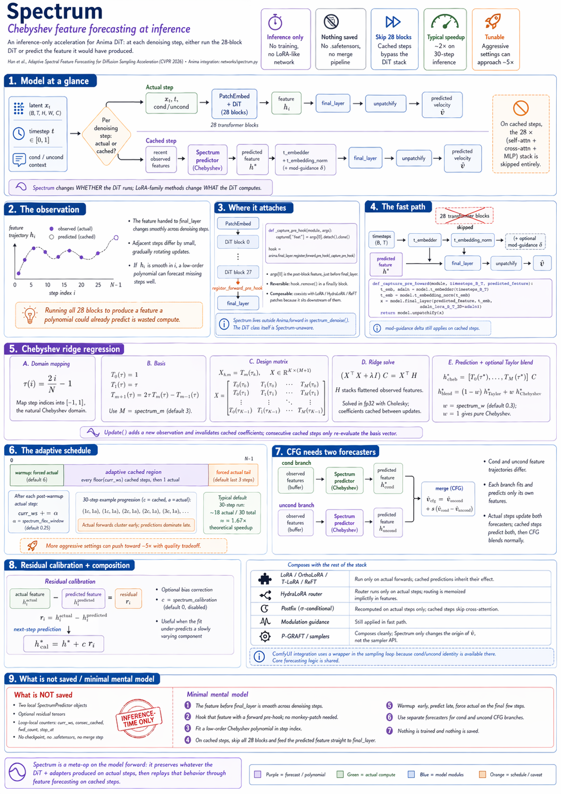

# Spectrum: Chebyshev feature forecasting at inference

An inference-only acceleration. No trained weights, no saved tensors — just a decision made once per denoising step: *run the DiT, or predict what it would have produced.* When the decision is "predict," the 28 transformer blocks are skipped and only the tiny heads at the end of the model run. Typical speedup on 30-step inference is ~2×, with tuning up to ~5×.

Reference: Han et al., Adaptive Spectral Feature Forecasting for Diffusion Sampling Acceleration, CVPR 2026 (upstream: https://github.com/yangheng95/Spectrum). Anima's integration: the denoise loop in `networks/spectrum.py`, the forecaster math in `networks/spectrum_forecast.py`.

This sits one layer above the LoRA family (`lora.md` and friends). Those all modify *what* the DiT computes at each step; Spectrum modifies *whether* the DiT runs at this step at all.



---

## 1. The observation

The DiT produces a feature $h_i$ at every step $i$ — specifically the tensor the block stack hands to `final_layer`, just before the projection back to latent space. Across a denoising trajectory, $h_i$ is not a random sequence of tensors: it's a smooth function of the step index, because the learned velocity field is continuous in $t$ and the noisy input evolves continuously under the sampler.

If $i \mapsto h_i$ is smooth, a cheap polynomial fit against a handful of observed $h_i$ predicts the unobserved ones well. Running all 28 blocks to produce a feature a polynomial could have told you is wasted compute. That's the entire idea.

---

## 2. Where it attaches

Not via monkey-patch. A single forward pre-hook on `final_layer`:

```python
def _capture_pre_hook(module, args):
    captured["feat"] = args[0].detach().clone()

hook = anima.final_layer.register_forward_pre_hook(_capture_pre_hook)
```

`args[0]` is whatever was about to be fed into `final_layer` — the output of the last DiT block. Every actual forward populates the capture; the denoise loop reads it, updates the forecaster, and optionally builds a residual-calibration bias (§6).

Two reasons to hook rather than patch:

- Reversible. The hook is removed in a `finally` block — Spectrum flips on and off with no state left on the model object.
- Composable. Pre-hooks coexist with whatever `forward`-replacing adapters have already patched the DiT's submodules. Spectrum sees only the post-block feature, downstream of all adapter effects.

The skip logic lives entirely outside `Anima.forward`: `spectrum_denoise()` calls `anima(...)` on actual steps and a fast path on cached steps. The DiT class has no Spectrum-awareness.

### 2.1 The fast path

On a cached step, only the head/tail of the model runs:

```python
def _spectrum_fast_forward(model, timesteps, predicted_feature):
    t_emb, adaln = model.t_embedder(timesteps)
    t_emb = model.t_embedding_norm(t_emb)
    if model._mod_guidance_delta is not None:
        t_emb = t_emb + model._mod_guidance_delta.unsqueeze(1)
    x = model.final_layer(predicted_feature, t_emb, adaln_lora_B_T_3D=adaln)
    return model.unpatchify(x)
```

`t_embedder` (a tiny MLP on the scalar timestep), optional mod-guidance delta, `final_layer`, `unpatchify`. The 28-block stack — 99% of the model's FLOPs — is bypassed; the predicted feature goes straight into `final_layer` as if it had come from the blocks.

---

## 3. Chebyshev ridge regression

`ChebyshevForecaster` (`networks/spectrum_forecast.py`). For a window of $K$ observations $\{(i_k, h_{i_k})\}$:

Domain mapping. Step indices map to $\tau = 2i/N - 1 \in [-1, 1]$ — the natural domain for Chebyshev $T_m$, where $|T_m(\tau)| \le 1$. Extrapolation outside that range blows up polynomially, so the forecaster is designed to interpolate / short-extrapolate within the trajectory, never beyond it.

Design matrix. Chebyshev polynomials of the first kind via the three-term recurrence $T_{m+1} = 2\tau T_m - T_{m-1}$, up to degree $M$ = `spectrum_m` (default 3 — a cubic basis).

Ridge solve. Flatten each observation to a vector, stack, and solve the $\ell_2$-regularized normal equations per feature column:

$$
(X^\top X + \lambda I)\,C\ =\ X^\top H
$$

via Cholesky — the Gram matrix is $(M{+}1)\times(M{+}1)$, SPD by construction, so the factorization is free; a jitter fallback reattempts on failure. The solve runs in fp32 even though features are bf16: a small Gram matrix is the last place to eat bf16 precision loss, and the cost is irrelevant.

Prediction. At a cached step, evaluate the basis at $\tau^\star$ and multiply by the cached coefficients. Coefficients are invalidated only when a new observation arrives, so consecutive cached steps re-evaluate just the basis vector — no re-solve.

Optional Taylor blend. `SpectrumPredictor` blends the global polynomial with a first-order forward difference on the last two observations:

$$
h^\star\ =\ (1 - w)\,h^\star_\text{Taylor}\ +\ w\,h^\star_\text{Chebyshev},\qquad w = \texttt{spectrum\_w}\ (\text{default } 0.3)
$$

The Taylor term is a local linear extrapolation — stable on the most recent observations but blind to curvature; the Chebyshev term captures curvature but can overshoot recent points. The default leans local.

---

## 4. The adaptive schedule

`spectrum_denoise` runs a small state machine per step deciding actual vs. cached. Three regions:

```
  step i:  0  .......... warmup  .................. stop_at  ..... N-1
           │    actual    │   adaptive cached    │    actual   │
           │  (forced)    │    + schedule        │  (forced)   │
```

- Warmup (default 6 steps): every step actual. The forecaster has nothing to regress against yet — and the high-noise early steps are where the velocity field is most nonlinear and prediction error hurts composition most.
- Adaptive region: alternates cached and actual. After every $\lfloor N_\text{curr}\rfloor$ consecutive cached steps comes an actual one, and after each post-warmup actual step the window grows: $N_\text{curr} \mathrel{+}= \alpha$ (`spectrum_flex_window`, default 0.25; start `window_size`, default 2.0).
- Stop region (default: last 3 steps): forced actual. Final refinement has the smallest residual noise to remove, so prediction error shows up as visible artifact — running them actual is cheap insurance.

Because $N_\text{curr}$ grows monotonically, Spectrum is a concentrate-then-predict schedule: actual forwards cluster early, predictions dominate late. That matches how the features actually behave — block outputs change fastest at high noise (composition forming) and slowest at low noise (refinement), so the polynomial extrapolates well over the long tail of similar refinement steps.

At 30-step defaults this lands around ~18 actual / 30 steps ≈ 1.67× theoretical speedup; pushing `flex_window` toward 3.0 and shrinking warmup shifts the ratio toward 5×, at the cost of extrapolation quality.

---

## 5. Two forecasters for CFG

CFG runs the DiT twice per step — real prompt and unconditional — and the two passes trace different feature trajectories: cond is attracted to the prompt, uncond drifts along the prior. One polynomial cannot serve both, so Spectrum carries two independent forecasters (`cond_fc` / `uncond_fc`), each fitted only on its own branch. On an actual step both branches run and both forecasters update; on a cached step both predict, and the CFG blend proceeds normally.

Because Spectrum sits after the CFG batching decision, both passes cache together — the 2× CFG cost is cut by the same factor as the single-pass case.

---

## 6. Residual calibration

The polynomial fit minimizes error on past observations, but each fresh actual forward typically reveals a small systematic residual $r_i = h_i^\text{actual} - h_i^\text{predicted}$ (e.g. a consistently under-predicted DC component). With `spectrum_calibration` $= c > 0$ (default 0 = off), that residual is cached and re-added to subsequent cached predictions as $h^\star + c\,r_i$. $c = 0.5$ is a reasonable start when prediction quality is borderline; $c = 1$ tends to overcorrect once the trajectory moves past the measurement point.

---

## 7. Composition with the rest of the stack

Spectrum applies at inference only, after everything else has attached. The pattern is consistent — **Spectrum is a meta-op on the model's forward**: whatever goes into producing $h_i$ on actual steps is baked into the polynomial fit and replayed on cached steps.

| Component                | Interaction                                                                                         |
| ------------------------ | --------------------------------------------------------------------------------------------------- |
| LoRA / OrthoLoRA / T-LoRA | Cached steps skip the patched forwards entirely; the LoRA math runs on actual steps and its effect rides inside the fit. No interface. |
| HydraLoRA / Chimera routers | Same — routers fire only on actual forwards. The fit implicitly memoizes the routing decisions through the features they produced. |
| Soft tokens              | The soft-token embeddings are appended on actual steps only; cached steps skip cross-attention entirely, so there is nothing to plumb on that branch. |
| Modulation guidance      | Its delta is applied inside the fast path (§2.1), so cached steps still see modulation steering.   |
| P-GRAFT                  | The cutoff toggles the network off mid-trajectory; the polynomial straddles the transition, and the warmup / stop-at regions force actual forwards at the sensitive ends. Composes cleanly. |
| Samplers                 | The sampler is called identically whether the velocity came from an actual or cached forward — any flow-matching sampler (Euler, ER-SDE, …) works unchanged. |

### 7.1 ComfyUI

The ComfyUI node (https://github.com/sorryhyun/ComfyUI-Spectrum-KSampler) uses a different attachment: a `model_function_wrapper` on a cloned model. ComfyUI's `calc_cond_batch` batches cond and uncond into a single call, so wrapper-level interception is where branch identity is available — exactly what's needed to route observations into the right forecaster. The forecaster core is shared between both integrations.

---

## 8. What is not saved

Everything Spectrum does lives in the inference loop's local variables — two predictor objects, two optional residual tensors, a few schedule counters — constructed at the start of `spectrum_denoise()` and torn down at the end. Nothing is serialized, nothing loaded; no `.safetensors`, no interaction with `scripts/toolkits/merge_to_dit.py`.

That's the defining property separating it from everything else in this directory: the others produce trained weights and live in a checkpoint. Spectrum is a pure inference-time decision policy.

---

## 9. Minimal mental model

1. The feature handed to `final_layer` is smooth across denoising steps — fit a Chebyshev polynomial in the step index.
2. Attachment is one removable pre-hook on `final_layer`; the DiT never knows.
3. On cached steps, run only `t_embedder` + `final_layer` + `unpatchify`; all 28 blocks skipped.
4. Schedule: forced-actual warmup, growing cached windows in the middle, forced-actual tail.
5. CFG gets two independent forecasters; residual calibration is an optional bias.
6. Composes transparently with the adapter zoo — their effects live inside the features being forecast.
7. Inference-only; nothing saved; no training.
