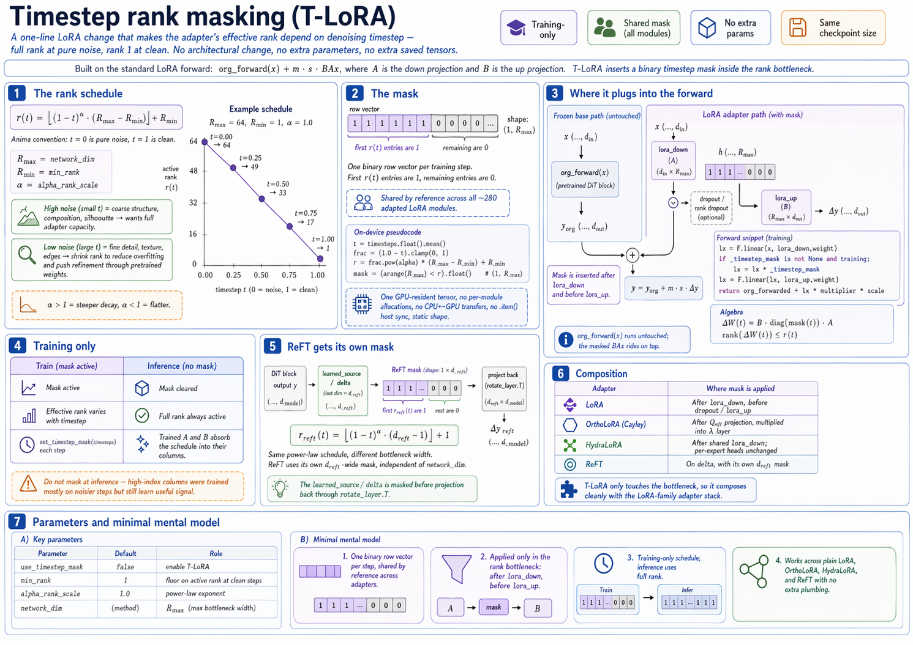

# Timestep rank masking (T-LoRA)

A one-line change to the LoRA forward that turns the adapter's effective rank into a function of the denoising timestep — full rank at pure noise, rank 1 at clean. No architectural change, no extra parameters, no extra saved tensors.

For the scaffolding this builds on, see `lora.md`: every target `Linear` is wrapped by a `LoRAModule` whose forward is `org_forward(x) + m·s·BAx`, with `A ∈ ℝ^{r×d_\text{in}}` (down) and `B ∈ ℝ^{d_\text{out}×r}` (up). T-LoRA multiplies a binary mask into the `r`-dim bottleneck between `A` and `B`.



---

## 1. The rank schedule

At each training step the batch-averaged timestep $t \in [0, 1]$ (where $t = 0$ is pure noise and $t = 1$ is clean data — the Anima convention; see §5 of `anima.md`) determines how many of the $R_\text{max} = \text{network\_dim}$ rank dimensions are active:

$$
r(t)\ =\ \Big\lfloor\ (1 - t)^{\alpha}\,\big(R_\text{max} - R_\text{min}\big)\ \Big\rfloor\ +\ R_\text{min}
$$

with `R_min = min_rank` (default 1) and `α = alpha_rank_scale` (default 1.0). The shape for $R_\text{max}=64$, $R_\text{min}=1$, $\alpha=1$:

| $t$ (noise level)  | active rank $r(t)$ |
| ------------------ | ------------------ |
| 0.0 (pure noise)   | 64 (full)          |
| 0.25               | 49                 |
| 0.5                | 33                 |
| 0.75               | 17                 |
| 1.0 (clean)        | 1                  |

Intuition: high-noise steps carry **coarse** structure (composition, silhouette) and want full adapter capacity to reshape the velocity field. Low-noise steps carry **fine detail** (texture, edges) — at that scale the base DiT is already good, and a wide LoRA is mostly a way to overfit the training set. Squeezing the rank down to 1 near $t = 1$ forces the low-noise refinement to flow through the pretrained weights.

`α` controls the curve shape. $\alpha = 1$ is the linear schedule above; $\alpha > 1$ concentrates more rank near the noise end (steeper decay); $\alpha < 1$ flattens.

---

## 2. The mask

A row vector of shape `(1, R_max)`:

$$
\text{mask}\ =\ [\,\underbrace{1,1,\dots,1}_{r(t)},\ \underbrace{0,0,\dots,0}_{R_\text{max}-r(t)}\,]
$$

One mask per step, **shared by reference** across all ~280 adapted LoRA modules. `networks/lora_anima/network.py:551–575` builds it on device each step and every module's `_timestep_mask` attribute points at the same tensor, so 280 module lookups cost one GPU-resident tensor — no CPU↔GPU transfers, no per-module allocations.

The mask build itself stays on device:

```python
t    = timesteps.float().mean()
frac = ((1.0 - t)).clamp(0, 1)
r    = frac.pow(α) · (R_max − R_min) + R_min
mask = (arange(R_max) < r).float()
```

No `.item()` host sync — `r` is a 0-dim tensor, and `arange < r` broadcasts into the mask buffer via `copy_`. Static shape, single graph.

---

## 3. Where it plugs into the forward

A two-line insert into `LoRAModule.forward` (`networks/lora_modules/lora.py:77–83`):

```python
lx = F.linear(x.float(), self.lora_down.weight.float())   # (..., R_max)

if self._timestep_mask is not None and self.training:      # ← T-LoRA
    lx = lx * self._timestep_mask

...
lx = F.linear(lx, self.lora_up.weight.float())             # (..., d_out)
return org_forwarded + (lx * multiplier * scale).to(...)
```

The mask sits **after** `lora_down` and **before** `lora_up`, zeroing high-index bottleneck columns. Algebraically, it is equivalent to multiplying the effective up-matrix by `diag(mask)`:

$$
\Delta W(t)\ =\ B\,\text{diag}(\text{mask}(t))\,A,\qquad
\operatorname{rank}\!\big(\Delta W(t)\big)\ \le\ r(t)
$$

so the full rank-$r(t)$ delta still composes cleanly with the frozen weight. `org_forward(x)` runs untouched, the masked $BAx$ rides on top.

### Training-only

`if self.training` is the whole story for inference. At test time the mask pointer is cleared (`clear_timestep_mask`, `network.py:602–608`) and the full rank is always live. Why: the trained `A` and `B` absorb the schedule into their columns — high-index columns are trained against fewer steps (only high-noise ones) but they still learn something, and the inference forward runs unmasked on purpose. Baking the mask into inference would erase that signal.

A call site in `train.py` hits `set_timestep_mask(timesteps)` and `set_reft_timestep_mask(timesteps)` right after noise sampling, per step.

---

## 4. ReFT gets its own mask

ReFT (`reft.md`) is a separate adapter on the DiT block's output — its own `reft_dim`-wide bottleneck, unrelated to `network_dim`. When T-LoRA is on, ReFT receives a second, independently computed mask:

$$
r_\text{reft}(t)\ =\ \big\lfloor (1-t)^{\alpha}\,(d_\text{reft} - 1)\big\rfloor + 1
$$

`network.py:577–600`. Same power-law curve, different dimension, floor of 1. The ReFT `learned_source` output is masked exactly the same way as the LoRA `lora_down` output, before projection back through `rotate_layer.T`.

---

## 5. Composition

T-LoRA touches only the `r`-dim bottleneck. Every adapter in the stack has one:

| Adapter                | Where mask is applied                                    |
| ---------------------- | -------------------------------------------------------- |
| **LoRA**               | After `lora_down`, before dropout / `lora_up`            |
| **OrthoLoRA (Cayley)** | After `Q_eff` projection, multiplied into `lambda_layer` |
| **HydraLoRA**          | After shared `lora_down`; per-expert heads unaffected    |
| **ReFT**               | On `delta`, with its own `reft_dim` mask                 |

So the default stack in `configs/methods/lora.toml` — classic LoRA + OrthoLoRA + T-LoRA + ReFT — is coherent: everyone's bottleneck gets masked by the same $t$, with adapter-appropriate dimensions.

---

## 6. Parameters

| Parameter           | Default | Role                                                            |
| ------------------- | ------- | --------------------------------------------------------------- |
| `use_timestep_mask` | `false` | Enable T-LoRA                                                   |
| `min_rank`          | `1`     | Floor on active rank at $t = 1$                                 |
| `alpha_rank_scale`  | `1.0`   | Power-law exponent (1 = linear, >1 = steeper, <1 = flatter)     |
| `network_dim`       | method  | $R_\text{max}$                                                  |

---

## 7. Minimal mental model

1. One binary row vector per step, shared by reference across every adapter.
2. Applied in the $r$-dim bottleneck — after `lora_down`, before `lora_up`.
3. Training-only: inference uses the full rank, and the trained weights absorb the schedule into their columns.
4. Because the mask only lives in the bottleneck, every LoRA-family adapter (plain, ortho, hydra, reft) composes with T-LoRA without extra plumbing.
