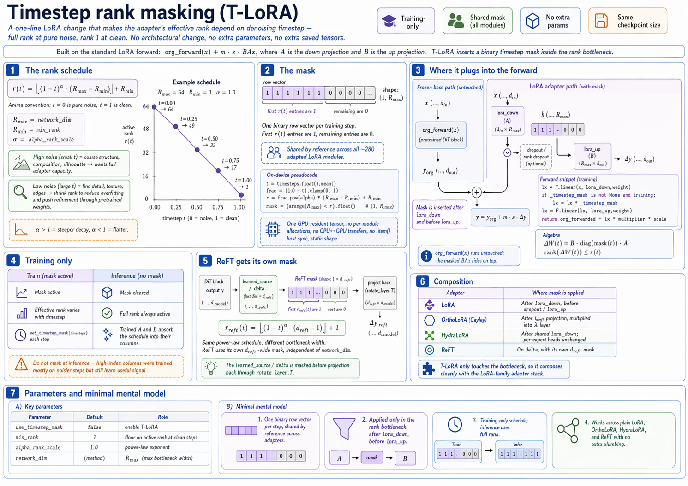

# Timestep rank masking (T-LoRA)

A one-line change to the LoRA forward that turns the adapter's effective rank into a function of the denoising noise level — **rank 1 at pure noise, full rank at clean**. No architectural change, no extra parameters, no extra saved tensors.

For the scaffolding this builds on, see `lora.md`: every target `Linear` is wrapped by a module whose forward is `org_forward(x) + m·s·BAx`. T-LoRA multiplies a binary mask into the `r`-dim bottleneck between `A` and `B`.



---

## 1. Why throttle rank by noise level

The intuition comes from what each noise band *decides*. High-noise steps fix coarse structure — layout, pose, silhouette, identity. That is exactly where a fine-tune memorizes its training images: give the adapter full capacity there and it learns to reproduce specific compositions rather than a style. Low-noise steps refine texture, edges, rendering — where the style you actually want to learn lives.

T-LoRA's schedule encodes that asymmetry: near pure noise the adapter is squeezed to `min_rank` (coarse structure stays with the base model); as the trajectory approaches clean data the full rank opens up for detail learning. This is the anti-overfitting scheme from the T-LoRA paper, and it composes as the anti-memorization arm of the default stack.

---

## 2. The rank schedule

At each training step the batch-averaged timestep determines how many of the $R_\text{max} = \text{network\_dim}$ rank dimensions are active. With $u \in [0,1]$ the *cleanliness* fraction ($u = 1 - t/t_\text{max}$: $u = 0$ at pure noise, $u = 1$ at clean):

$$
r(u)\ =\ u^{\alpha}\,\big(R_\text{max} - R_\text{min}\big)\ +\ R_\text{min}
$$

with `R_min = min_rank` (default 1) and `α = alpha_rank_scale` (default 1.0). The shape for $R_\text{max}=64$, $R_\text{min}=1$, $\alpha=1$:

| noise level σ      | active rank $r$ |
| ------------------ | --------------- |
| 1.0 (pure noise)   | 1               |
| 0.75               | ~17             |
| 0.5                | ~33             |
| 0.25               | ~49             |
| 0.0 (clean)        | 64 (full)       |

`α` controls the curve shape: $\alpha = 1$ is linear; $\alpha > 1$ keeps rank low deeper into the trajectory; $\alpha < 1$ opens rank up earlier. (There is no `floor()` — the cutoff is a continuous threshold, see §3.)

One practical note from benching: the schedule only *does* anything when `min_rank` is genuinely small relative to `network_dim`. At `dim=32, min_rank=16` the mask is nearly inert; at `dim=16, min_rank=1` it visibly flattens the learned spectrum.

---

## 3. The mask

A row vector of shape `(1, R_max)`:

$$
\text{mask}\ =\ [\,\underbrace{1,1,\dots,1}_{r},\ \underbrace{0,0,\dots,0}_{R_\text{max}-r}\,]
$$

One mask per step, shared by reference across all ~280 adapted LoRA modules (`networks/lora_anima/network.py`). The network builds it once on device and rebinds every module's `_timestep_mask` buffer to the same tensor — 280 module lookups cost one GPU-resident tensor, no per-module allocations.

The build itself never leaves the device:

```python
t    = timesteps.float().mean()          # batch-averaged
frac = ((max_t - t) / max_t).clamp(0, 1) # cleanliness u
r    = frac.pow(α) · (R_max − R_min) + R_min
mask = (arange(R_max) < r).float()       # 0-dim tensor threshold — no .item()
```

No host sync, static shape, single compile graph — the same rule as everywhere else in the hot path (`anima-optimizations.md` §4.4).

---

## 4. Where it plugs into the forward

The mask sits in the bottleneck, first — after `lora_down`, before dropout and `lora_up`:

```python
lx = lora_down(x)                 # (..., R_max)
lx = lx * self._timestep_mask     # ← T-LoRA (training only)
lx = dropout(lx); lx, scale = rank_dropout(lx)
lx = lora_up(lx)
```

Algebraically it multiplies the effective delta by `diag(mask)`:

$$
\Delta W(t)\ =\ B\,\text{diag}(\text{mask}(t))\,A,\qquad
\operatorname{rank}\!\big(\Delta W(t)\big)\ \le\ r(t)
$$

so the masked delta still composes cleanly with the frozen weight; `org_forward(x)` runs untouched.

### Training-only

At inference the mask is cleared and the full rank is always live. Why: the trained `A` and `B` absorb the schedule into their columns — high-index columns were trained against fewer (low-noise) steps but still learned something, and the inference forward runs unmasked on purpose. Baking the mask into inference would throw that signal away. (Because inference is always full-rank, merging a T-LoRA-trained checkpoint into the DiT is bit-equivalent to running it live.)

`train.py` calls `set_timestep_mask(timesteps)` right after noise sampling, once per step. Only `network.py`/`factory.py` should ever touch `set_timestep_mask`/`clear_timestep_mask` — any code that runs the LoRA modules mid-step must find the mask already set.

---

## 5. Composition

T-LoRA touches only the `r`-dim bottleneck, and every adapter in the family has one:

| Adapter                | Where the mask lands                                          |
| ---------------------- | ------------------------------------------------------------- |
| LoRA                   | After `lora_down`, before dropout / `lora_up`                 |
| OrthoLoRA / OrthoInit  | Multiplied into the diagonal scale $\lambda$ (gates the singular values) |
| HydraLoRA              | After shared `lora_down`; router gates unaffected (routing must never see the mask) |
| ChimeraHydra           | Content branch only — the freq branch stays full-rank at every $t$ (`chimera-hydra.md` §4) |

---

## 6. Parameters

| Parameter           | Default | Role                                                            |
| ------------------- | ------- | --------------------------------------------------------------- |
| `use_timestep_mask` | on in the live `lora.toml` | Enable T-LoRA                                |
| `min_rank`          | `1`     | Floor on active rank at pure noise                              |
| `alpha_rank_scale`  | `1.0`   | Power-law exponent (1 = linear, >1 = stays low longer)          |
| `network_dim`       | method  | $R_\text{max}$                                                  |

---

## 7. Minimal mental model

1. High noise decides layout — where memorization happens — so rank is squeezed to `min_rank` there; full rank opens up toward clean, where style detail is learned.
2. One binary row vector per step, built on device, shared by reference across every adapter.
3. Applied first thing in the $r$-dim bottleneck; routing and dropout never influence (or see) it.
4. Training-only: inference always runs full rank, and the trained columns have absorbed the schedule.
