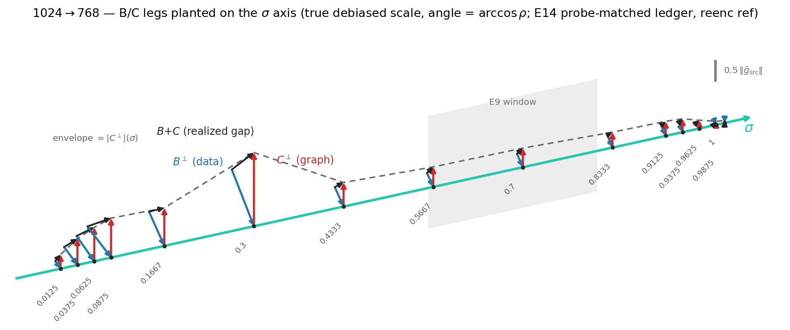
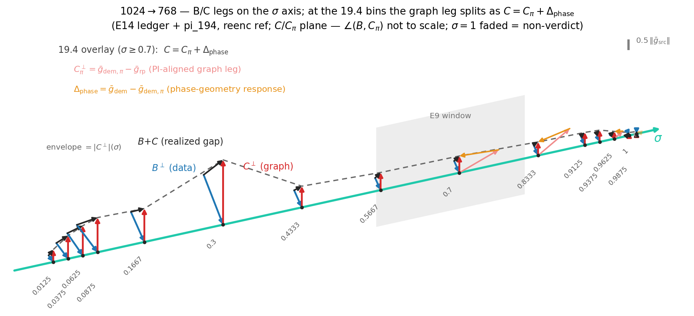
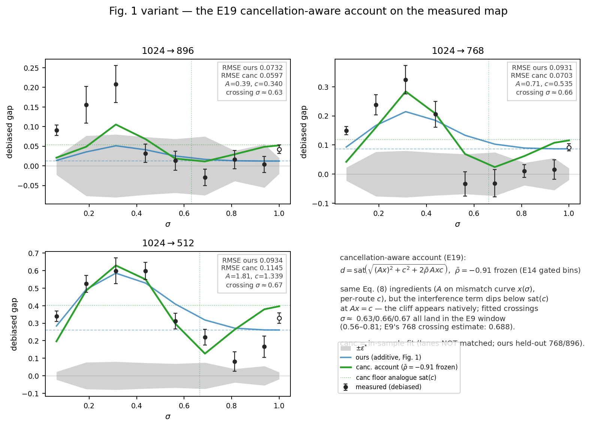
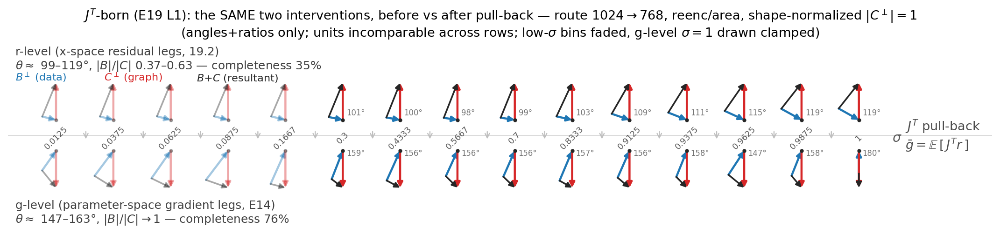
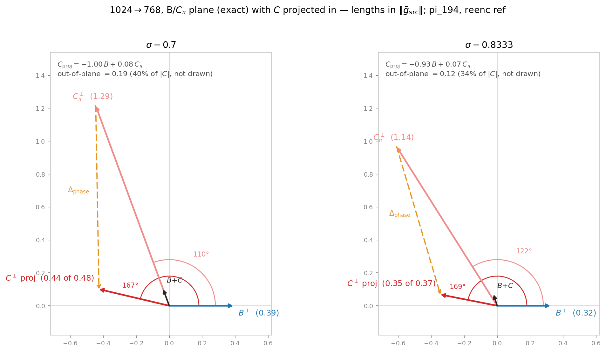

# E19 appendix — the B/C geometry, per σ, in one picture



`fig_bc_comb.py` → `bc_comb_768.png`. Figure assembly only — every
number is read from the committed E14 probe-matched ledger
(`runs/20260801-2304-e14-ledger-probematched/ledger.json`, reenc ref);
nothing is refit. Companion to the paper's Fig. `ledgergeom`, which
draws one σ bin per route; this draws one route (1024→768) across all
15 bins.

## Conventions

- At each bin slot: **B⊥** (data leg, blue) points straight up at its
  true debiased length √(2S)·‖ḡ‖; **C⊥** (graph leg, red) folds back
  from B's tip at the bin's angle arccos ρ (debiased ρ, clamped to
  [−1, 1] for drawing); **B+C** (black) runs base → C-tip and is the
  realized gap vector. One shared scale (bar at right, units of
  ‖ḡ_src‖); the dashed envelope traces |B⊥|(σ).
- Bin slots are **equally spaced** (the E14 grid is dense at both ends;
  planting at true σ would overlap the low-σ triangles). σ values label
  the slots; the E9 reduction-failure window (σ 0.56–0.81) is shaded.
- Unit-honesty carries over: the σ=1 slot is a non-verdict cell
  (ratio-of-small-numbers; its ρ = −1.02 is out of the estimator's
  domain and drawn clamped), and leg *magnitudes* are licensed via
  h(·) in the ledger — the drawing uses √(2S), √(2F) for shape only.

## The three reads the format makes visible

1. **The near-cancellation, at a glance.** At σ = 0.3 both legs are
   ~1.6–1.9 ‖ḡ‖ — each intervention alone is enormous — while the black
   resultant is ~20% of either leg. The gap the training run actually
   feels is the small residue of two large opposed responses.
2. **Shape-invariance vs scale collapse.** The triangle's *shape*
   (angle ρ ≈ −0.8…−0.93, ratio 0.62–0.99) barely changes from
   σ = 0.0125 to 0.9875; what changes is overall scale — legs shrink
   ~40× from the σ = 0.3 peak to the endpoint, with the sharp drop at
   σ 0.3 → 0.43 just before the window. This is the visual form of the
   E19 verdict chain: the angle is a global, σ-stable property (19.3:
   also depth- and type-uniform), not a feature of any particular
   regime.
3. **Why 768 never fully heals.** |B⊥| < |C⊥| at every bin (no
   crossing, 19.0 item 4), so a same-direction residue of C always
   survives — the black arrows all point the same way. On 896 the
   analogous picture would show the blue leg overtaking the red near
   σ ≈ 0.5 (the crossing = the cliff mechanism), killing the resultant
   inside the window.

## One caution for readers of the paper's depth table

The floor's depth profile (early blocks 3–8 carry ~3× the late-block
gap at σ = 1 — Q2, the paper's `tab:depth`) and the cancellation
angle's depth profile (19.3: uniform, no special band, magnitude ∝
branch energy) are **different quantities in different σ regimes**.
Both are true; conflating them would suggest the anti-alignment lives
early-block, which 19.3 refuted.

## Regenerate

```bash
uv run python project/sigma_lowres/paper_bench/experiments/e19/fig_bc_comb.py
```

Variants worth drawing on demand: the same comb for 896/512 (three
stacked rows makes the crossing/no-crossing contrast per route
visible).

## The 19.4 split variant — C as two arrows



`fig_bc_split.py` → `bc_comb_768_split.png`. Same comb, but at the
19.4 bins (σ = 0.7 / 0.8333 / 0.9625 / 1) the graph leg is drawn as
the resultant of two arrows, using the causal decomposition the
PI-align arm licenses:

    C = C_pi + Δ_phase,   C_pi = ḡ_dem,π − ḡ_rp  (PI-aligned graph leg)
                          Δ_phase = ḡ_dem − ḡ_dem,π  (phase response)

This is a vector identity (both terms are measured arm means from one
process, run `20260807-1400-e194-pi-causal`), so the split is exact by
construction; what 19.4 adds is that the two pieces are *large and
opposed*: at σ = 0.7 on 768, |C| ≈ 0.48 ‖ḡ‖ but |C_pi| ≈ 1.29 and
|Δ_phase| ≈ 1.13 — the small red leg the E14 ledger sees is itself the
residue of a second near-cancellation, between the phase-aligned graph
response and the phase-geometry response. That is the visual form of
19.4 item 3 (h(C_pi) ≈ 2×h(C); phase geometry is part of what lets the
legs magnitude-match).

Drawing honesty:

- The overlay triangle lives in the **C/C_pi plane**: |C_pi|, |Δ_phase|
  and ∠(C, C_pi) = arccos(cos_C_Cpi) are to scale; ∠(B, C_pi) is NOT —
  B/C/C_pi genuinely span 3D (planar mismatch 14–27° at the verdict
  bins; true ρ_pi in `pi_194.json`).
- At each shared bin the 19.4 triangle is rescaled by C_e14/C_194
  (≈ 1.05–1.16 — the two ledgers replicate) so the split lands exactly
  on the comb's C arrow.
- Mid-σ bins carry **no** split by design: PI is off-manifold with
  content there (G11), so the decomposition is only licensed on the
  noise-dominated tail. The σ = 1 overlay is faded (non-verdict:
  rel_cos_Cpi = 0.58, ratio-of-small-numbers).

## Fig.-1 variant — the cancellation-aware account (demonstration)



`../../fig_accounts_canc.py` → `accounts_canc.png`. Eq. (8)'s own
ingredients — route amplitude A on the measured mismatch curve x(σ),
per-route constant c — recomposed through the exact angular link WITH
the measured interference, carried by ONE frozen global constant
ρ̄ = −0.910 (E14 gated verdict bins; licensed as global by 19.0
route-uniformity, 19.3 depth/type-uniformity, 19.6 operating-point
invariance): d = sat(√((Ax)² + c² + 2ρ̄·Ax·c)). Same parameter count
as the additive form plus one shared constant. What it buys:

- **The cliff appears natively.** The interference term dips below the
  floor analogue sat(c) near Ax = c — the additive form sat(Ax) + F is
  structurally unable to go below its floor, which is why it misses the
  in-window near-zero bins on 896/768. Fitted crossings land at
  σ ≈ 0.63 / 0.66 / 0.67 — all inside the E9 reduction-failure window
  (0.56–0.81), near E9's 768 crossing estimate (0.688). NB the estimand
  differs from the ledger's leg-ratio crossing: E14's 896 leg crossing
  sits lower (≈ 0.47–0.53) and its 768 ledger has no leg crossing at
  all — the fitted Ax = c locates the *gap-curve dip*, not √(S/F) = 1.
- RMSE (in-sample, see caveat): 896 0.060 vs ours 0.073; 768 0.070 vs
  0.093; 512 0.114 vs 0.093 — 512 over-cancels mid-window, consistent
  with 19.0's "unsafe = mismatched magnitudes" (a global ρ̄ imposes
  more cancellation than the unsafe route's legs deliver).

**Caveat (why this is a demonstration, not the paper lane):** the canc
fits are in-sample 2-param per route, while Fig. 1's "ours" is held-out
on 768/896 via governors — RMSE is not lane-matched. The upgrade lane
would refit (A, c) under the canc link with the same governor/held-out
protocol; all ingredients are committed, CPU-only.

## The Jᵀ pull-back mirror comb — the L1 verdict in one picture



`fig_jt_pullback.py` → `jt_pullback_768.png`: the same two interventions
drawn at both levels on one σ axis, route 1024→768, reenc/area — top =
r-level legs (19.2, `measured_192.json`), bottom = g-level legs (E14
ledger), every triangle **shape-normalized** to |C⊥| = 1 (the two levels
live in incomparable units; only arccos ρ and |B|/|C| are drawn — exactly
the two quantities the L1 verdict is about). Before pull-back the legs
are near-perpendicular (99–103° mid-σ) at ratio ~0.4 and the resultant
is large (geometric completeness 35%); after ḡ = E[Jᵀ r] the SAME
interventions read 147–163° with ratio → 1 and the resultant collapses
(76%). Both ingredients of the near-cancellation — the angle depth AND
the magnitude matching (no r-level crossing anywhere, 19.2 item 3) —
are made in gradient formation. Low-σ bins faded (non-verdict); the
g-level σ=1 wedge is drawn clamped (ρ = −1.019, out-of-domain).

Shorthand caveat: "Jᵀ-born" ≠ one shared Jᵀ applied to two fields — C's
intervention changes the operator itself (demoted graph, its RoPE phase
geometry included), which is why 19.4 can rotate C by PI-aligning the
phases inside the demoted forward.

### Per-bin plane view (exact 2D)



`fig_bc_plane.py` → `bc_plane_768.png`: σ = 0.7 / 0.8333 drawn in the
**B/C_pi plane** — there the lengths and ∠(B, C_pi) are exact
(110°/122°: with phases PI-aligned the graph leg is *near-orthogonal*
to B at σ = 0.7), and C enters as its orthogonal projection
(92–94% of |C| in-plane; out-of-plane share annotated). The projection
solves the Gram normal equations to
**C_proj = −1.00 B + 0.08 C_pi** (σ = 0.7; −0.93/+0.07 at 0.8333):
in this plane the graph leg is "minus the data leg" plus a small slice
of the phase-aligned response, and the in-plane realized gap B + C is
almost purely that slice.
